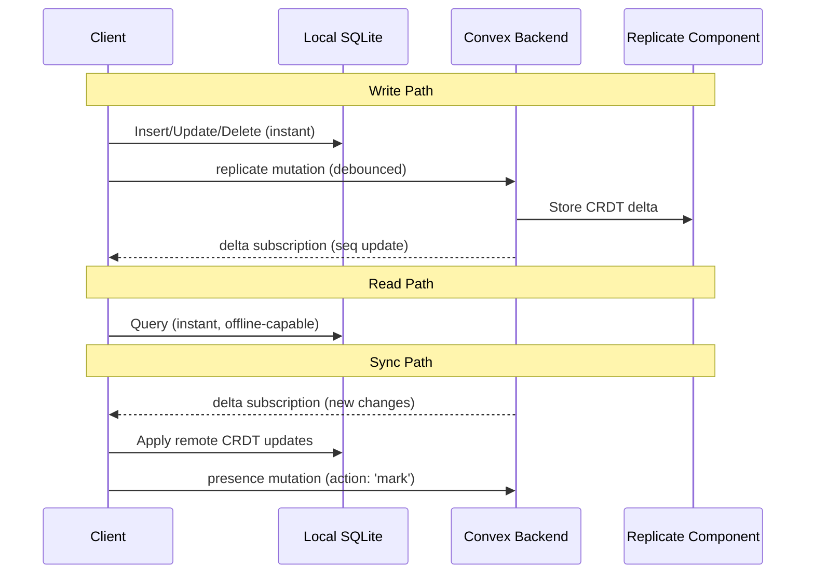
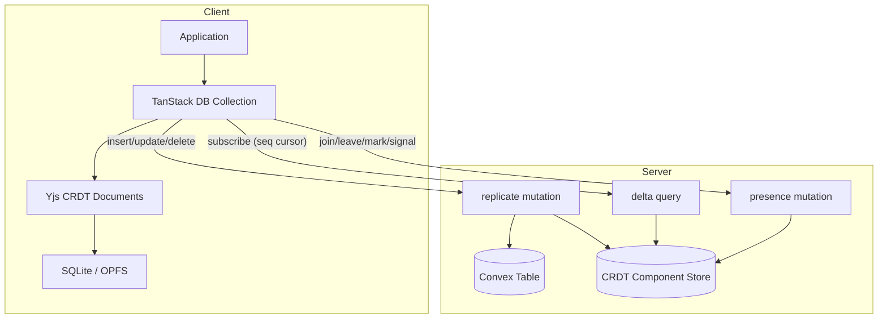

# Replicate

A local-first sync engine for [Convex](https://convex.dev). Replicate keeps a full copy of your data in client-side SQLite (via OPFS on web, op-sqlite on React Native) and syncs changes through Convex using CRDTs (Yjs). Users get instant reads, offline writes, and real-time collaboration without writing conflict resolution logic.

## Architecture

### Data Flow



### Dual-Storage Pattern



The client maintains two representations of each document:

1. **Materialized JSON** in SQLite — for fast queries and offline reads
2. **Yjs CRDT binary** in SQLite — for conflict-free merging of concurrent edits

The server stores the same pair in Convex: the materialized document in a standard table, and the CRDT state in the Replicate component's internal tables.

## Installation

```bash
npm install @trestleinc/replicate convex
```

Install the Replicate component in your Convex project:

```typescript
// convex/convex.config.ts
import { defineApp } from 'convex/server';
import replicate from '@trestleinc/replicate/component';

const app = defineApp();
app.use(replicate);

export default app;
```

## Quick Start

### Step 1: Define Your Schema

Use `schema.define()` to create a versioned schema. This single definition serves both the Convex table (via `.table()`) and the client collection.

```typescript
// convex/schema/tasks.ts
import { v } from 'convex/values';
import { schema } from '@trestleinc/replicate/server';

export const taskSchema = schema.define({
	shape: v.object({
		id: v.string(),
		title: v.string(),
		status: v.union(v.literal('todo'), v.literal('done')),
		createdAt: v.number(),
	}),

	// Additional indexes (by_doc_id and by_timestamp are auto-applied)
	indexes: (t) => t.index('by_status', ['status']),

	defaults: {
		status: 'todo',
	},

	history: {},
});
```

Wire it into your Convex schema:

```typescript
// convex/schema.ts
import { defineSchema } from 'convex/server';
import { taskSchema } from './schema/tasks';

export default defineSchema({
	tasks: taskSchema.table(),
});
```

The `.table()` method:

- Injects a `timestamp` field (used internally for ordering)
- Auto-applies `by_doc_id` index on `['id']` and `by_timestamp` index on `['timestamp']`
- Applies your custom indexes on top

If you have server-only fields that should never sync to clients:

```typescript
export default defineSchema({
	tasks: taskSchema.table({
		private: {
			internalScore: v.number(),
			adminNotes: v.string(),
		},
	}),
});
```

Private fields are stored in Convex but automatically stripped from `material` and `delta` responses before reaching the client.

### Step 2: Create Server Functions

```typescript
// convex/tasks.ts
import { collection } from '@trestleinc/replicate/server';
import { components } from './_generated/api';
import type { Doc } from './_generated/dataModel';
import { taskSchema } from './schema/tasks';

export const { material, delta, replicate, presence, session } = collection.create<Doc<'tasks'>>(
	components.replicate,
	'tasks',
	{
		schema: taskSchema,
	}
);
```

`collection.create()` returns five Convex functions:

| Export      | Type     | Purpose                                            |
| ----------- | -------- | -------------------------------------------------- |
| `material`  | query    | Paginated materialized documents (for SSR seeding) |
| `delta`     | query    | Real-time CRDT stream + recovery                   |
| `replicate` | mutation | Unified insert/update/delete                       |
| `presence`  | mutation | Session management (join/leave/mark/signal)        |
| `session`   | query    | Query connected sessions                           |

### Step 3: Define Your Client Collection

```typescript
// src/collections/useTasks.ts
import { collection, persistence } from '@trestleinc/replicate/client';
import { ConvexClient } from 'convex/browser';
import { api } from '$convex/_generated/api';
import { taskSchema } from '$convex/schema/tasks';
import type { Infer } from 'convex/values';

const sqlite = persistence.web.sqlite.once({
	name: 'myapp',
	worker: async () => {
		const { default: SqliteWorker } = await import('@trestleinc/replicate/worker?worker');
		return new SqliteWorker();
	},
});

export const tasks = collection.create({
	schema: taskSchema,
	persistence: sqlite,
	config: () => ({
		convexClient: new ConvexClient(import.meta.env.VITE_CONVEX_URL),
		api: api.tasks,
		getKey: (task: Task) => task.id,
	}),
});

export type Task = Infer<typeof taskSchema.shape>;
```

### Step 4: Initialize and Use

Initialize the collection with optional server-seeded data, then query it like any TanStack DB collection:

```typescript
// Initialize (call once at app startup or route load)
await tasks.init(materialFromSSR);

// Get the underlying TanStack DB collection
const collection = tasks.get();

// Insert
collection.insert({
	id: crypto.randomUUID(),
	title: 'Buy groceries',
	status: 'todo',
	createdAt: Date.now(),
});

// Update
collection.update(taskId, (draft) => {
	draft.status = 'done';
});

// Delete
collection.delete(taskId);
```

All mutations apply instantly to the local SQLite store. The sync engine debounces and batches changes, then sends them to Convex via the `replicate` mutation. If the server rejects a mutation (e.g., authorization failure), the local change is rolled back.

### Step 5: Server-Side Rendering

For SSR, fetch materialized data on the server and pass it to `init()` on the client. This seeds the local store on first visit; subsequent navigations read from SQLite directly.

**SvelteKit** — use a universal load (not `+layout.server.ts`) so client-side navigations never block on the network:

```typescript
// src/routes/+layout.ts
import { PUBLIC_CONVEX_URL } from '$env/static/public';
import { ConvexHttpClient } from 'convex/browser';
import { api } from '$convex/_generated/api';
import { browser } from '$app/environment';

export async function load() {
	// Client-side: local SQLite has the data, don't block navigation
	if (browser) {
		return { tasksMaterial: undefined };
	}

	// Server-side: seed with fresh data for first paint
	const http = new ConvexHttpClient(PUBLIC_CONVEX_URL);
	try {
		const page = await http.query(api.tasks.material, { numItems: 25 });
		return {
			tasksMaterial: { pages: [page], cursor: page.continueCursor, isDone: page.isDone },
		};
	} catch {
		return { tasksMaterial: undefined };
	}
}
```

Then in your layout component:

```svelte
<script>
	import { tasks } from '$collections/useTasks';

	const { data } = $props();

	$effect(() => {
		tasks.init(data.tasksMaterial);
	});
</script>
```

### Step 6: Pagination

Load more data from the server when the user scrolls:

```typescript
const { pagination } = tasks;

// Load next page
await pagination.load();

// Check state
pagination.status; // 'idle' | 'busy' | 'done' | 'error'
pagination.canLoadMore; // boolean
pagination.count; // total loaded so far

// Subscribe to pagination state changes
const unsub = pagination.subscribe((state) => {
	console.log(state.status, state.count);
});
```

## Features

### Rich Text / Prose Fields

Replicate supports collaborative rich text editing through Yjs-backed prose fields. Define a prose field in your schema with `schema.prose()`:

```typescript
export const noteSchema = schema.define({
	shape: v.object({
		id: v.string(),
		title: v.string(),
		content: schema.prose(), // ProseMirror-compatible JSON
	}),
	// ...
});
```

On the client, bind a prose field to a TipTap or ProseMirror editor:

```typescript
const collection = notes.get();
const doc = collection.find((n) => n.id === noteId);

// Get a document handle for presence + prose binding
const handle = collection.getDocumentHandle(noteId);

// Create an editor binding (returns Yjs XmlFragment + Awareness)
const binding = await handle.prose('content', {
	user: () => ({ name: 'Alice', color: '#ff0000' }),
	debounceMs: 50,
});

// binding.fragment — pass to TipTap's Collaboration extension
// binding.provider.awareness — pass to CollaborationCursor extension
// binding.pending — true while local changes haven't synced
// binding.destroy() — cleanup
```

**Client-side utilities:**

```typescript
import { schema } from '@trestleinc/replicate/client';

// Extract plain text from a prose value (for search indexing)
const text = schema.prose.extract(doc.content);

// Create an empty prose value
const empty = schema.prose.empty();
```

### Persistence Providers

Replicate ships with several persistence backends:

| Provider                                     | Platform     | Description                                    |
| -------------------------------------------- | ------------ | ---------------------------------------------- |
| `persistence.web.sqlite.create(options)`     | Browser      | wa-sqlite in a Web Worker with OPFS storage    |
| `persistence.web.sqlite.once(options)`       | Browser      | Same as above, but returns a singleton factory |
| `persistence.native.sqlite.create(db, name)` | React Native | op-sqlite integration                          |
| `persistence.memory.create()`                | Any          | In-memory (for testing)                        |
| `persistence.custom.create(adapter)`         | Any          | Bring your own `StorageAdapter`                |

**Web SQLite options:**

```typescript
interface WebSqliteOptions {
	name: string; // Database name in OPFS
	worker: Worker | (() => Worker | Promise<Worker>);
}
```

The `once()` variant returns `() => Promise<Persistence>` — a lazy factory that creates the SQLite instance on first call and reuses it for all collections. Use this when multiple collections share one database:

```typescript
const sqlite = persistence.web.sqlite.once({
  name: 'myapp',
  worker: async () => {
    const { default: W } = await import('@trestleinc/replicate/worker?worker');
    return new W();
  },
});

// Both collections share the same SQLite instance
const tasks = collection.create({ persistence: sqlite, ... });
const comments = collection.create({ persistence: sqlite, ... });
```

For faster startup, preload the WASM module in your HTML `<head>`:

```typescript
import { preloadLinks } from '@trestleinc/replicate/client';

// Returns <link rel="preload"> tags for the WASM binary
const links = preloadLinks();
```

### Views (Row-Level Filtering)

Views control which documents a user can see. They run server-side and filter the `material`, `delta`, and `session` queries:

```typescript
import { collection } from '@trestleinc/replicate/server';
import type { ViewFunction } from '@trestleinc/replicate/server';

const ownerView: ViewFunction = async (ctx, query) => {
	const identity = await ctx.auth.getUserIdentity();
	if (!identity) return query.filter((q) => q.eq(q.field('isPublic'), true));
	return query.filter((q) =>
		q.or(q.eq(q.field('ownerId'), identity.subject), q.eq(q.field('isPublic'), true))
	);
};

export const { material, delta, replicate, presence, session } = collection.create<Doc<'tasks'>>(
	components.replicate,
	'tasks',
	{
		schema: taskSchema,
		view: ownerView,
	}
);
```

The view function receives a `QueryInitializer` and returns a filtered/ordered query. It applies to all read paths — the client only receives documents that pass the filter.

### Presence & Sessions

Track who's connected and where their cursor is:

```typescript
// Server-side: session query is already exported from collection.create()
// Client-side:
const collection = tasks.get();
const sessions = collection.sessions;

// Get all sessions for a document
const active = sessions.get(docId);
// [{ client, document, user, profile, cursor, connected }]

// Subscribe to session changes
const unsub = sessions.subscribe((allSessions) => {
	// Update presence UI
});
```

The presence system uses a heartbeat mechanism. Clients send `join` on connect, periodic `signal` to stay alive, and `leave` on disconnect. Stale sessions are cleaned up after the configured timeout (default: 24h).

### Delete Pattern

Replicate uses **hard deletes** in the main Convex table and **soft deletes** (append-only) in the CRDT component store. When a client deletes a document:

1. The local collection removes it immediately
2. The `replicate` mutation with `type: 'delete'` runs on the server
3. The server deletes the row from the Convex table
4. The server appends a tombstone delta to the component store
5. Other clients receive the tombstone via the `delta` subscription and remove the document locally

If the server mutation fails (e.g., authorization), the client rolls back the delete and the document reappears.

## Sync Protocol

### Overview

The sync system uses three Convex endpoints:

| Endpoint    | Type     | Purpose                                |
| ----------- | -------- | -------------------------------------- |
| `delta`     | query    | Subscribe to CRDT changes (reactive)   |
| `replicate` | mutation | Send local changes to server           |
| `presence`  | mutation | Report session state and sync progress |

### delta Query

The `delta` query serves two purposes depending on its arguments:

**Streaming mode** (`{ seq, limit? }`): Returns all CRDT changes since the given sequence number. The client subscribes to this query reactively — Convex re-runs it whenever new deltas are written, pushing updates to the client.

**Recovery mode** (`{ document, vector }`): On startup, the client sends its local Yjs state vector for each document. The server returns only the missing deltas needed to bring the client up to date. This avoids re-downloading the full CRDT state.

### replicate Mutation

A unified mutation handling all write operations:

```typescript
// Client sends one of:
{ type: 'insert', document: id, bytes: crdtUpdate, material: { ...fields } }
{ type: 'update', document: id, bytes: crdtUpdate, material: { ...fields } }
{ type: 'delete', document: id, bytes: crdtUpdate }
```

The server:

1. Runs authorization hooks (`evalWrite` / `evalRemove`)
2. Writes/patches/deletes the document in the Convex table
3. Stores the CRDT delta in the component
4. Runs side-effect hooks (`onInsert` / `onUpdate` / `onRemove`)
5. Returns the new sequence number

### presence Mutation

Handles four actions:

| Action   | Purpose                                                |
| -------- | ------------------------------------------------------ |
| `join`   | Register a session for a document                      |
| `leave`  | Deregister a session                                   |
| `mark`   | Report the client's current seq/vector (sync progress) |
| `signal` | Heartbeat + cursor/profile update                      |

### Automatic Compaction

When the delta count for a document exceeds the configured threshold (default: 500), the component automatically compacts the CRDT history into a snapshot. This keeps query performance constant regardless of edit history length.

Configure via the `compaction` option:

```typescript
collection.create(components.replicate, 'tasks', {
	compaction: {
		threshold: 1000, // Compact after 1000 deltas (default: 500)
		timeout: '48h', // Session timeout (default: 24h)
		retain: 5, // Keep 5 historical snapshots (default: 0)
	},
});
```

## Advanced Usage

### Custom Hooks

Hooks let you add authorization guards and side-effects to server operations:

```typescript
collection.create<Doc<'tasks'>>(components.replicate, 'tasks', {
	schema: taskSchema,
	hooks: {
		// Authorization guards — throw to deny the operation
		evalWrite: async (ctx, doc) => {
			const identity = await ctx.auth.getUserIdentity();
			if (!identity) throw new Error('Unauthorized');
			if (doc.ownerId !== identity.subject) throw new Error('Forbidden');
		},
		evalRemove: async (ctx, docId) => {
			const identity = await ctx.auth.getUserIdentity();
			if (!identity) throw new Error('Unauthorized');
		},
		evalSession: async (ctx, clientId) => {
			const identity = await ctx.auth.getUserIdentity();
			if (!identity) throw new Error('Unauthorized');
		},

		// Side-effects — run after the operation succeeds
		onInsert: async (ctx, doc) => {
			/* notify, log, etc. */
		},
		onUpdate: async (ctx, doc) => {
			/* ... */
		},
		onRemove: async (ctx, docId) => {
			/* ... */
		},
		onDelta: async (ctx, result) => {
			/* runs after delta query */
		},

		// Transform materialized documents before returning to clients
		transform: (docs) => docs.map((d) => ({ ...d, computed: d.a + d.b })),
	},
});
```

| Hook          | Runs in                     | Purpose                       |
| ------------- | --------------------------- | ----------------------------- |
| `evalWrite`   | `replicate` (insert/update) | Guard writes                  |
| `evalRemove`  | `replicate` (delete)        | Guard deletes                 |
| `evalSession` | `presence`                  | Guard session operations      |
| `onInsert`    | `replicate` (insert)        | Side-effect after insert      |
| `onUpdate`    | `replicate` (update)        | Side-effect after update      |
| `onRemove`    | `replicate` (delete)        | Side-effect after delete      |
| `onDelta`     | `delta`                     | Side-effect after delta query |
| `transform`   | `material`                  | Shape response documents      |

### Custom Storage Backends

Implement the `StorageAdapter` interface to use any key-value store:

```typescript
import { persistence } from '@trestleinc/replicate/client';

const myAdapter: StorageAdapter = {
	async get(key: string): Promise<Uint8Array | undefined> {
		/* ... */
	},
	async set(key: string, value: Uint8Array): Promise<void> {
		/* ... */
	},
	async delete(key: string): Promise<void> {
		/* ... */
	},
	async keys(prefix: string): Promise<string[]> {
		/* ... */
	},
	close?(): void {
		/* optional cleanup */
	},
};

const tasks = collection.create({
	schema: taskSchema,
	persistence: () => persistence.custom.create(myAdapter),
	config: () => ({
		/* ... */
	}),
});
```

### Logging

Replicate uses [LogTape](https://github.com/dahlia/logtape) for structured logging. Configure it in your app's entry point:

```typescript
import { configure, getConsoleSink } from '@logtape/logtape';

await configure({
	sinks: { console: getConsoleSink() },
	loggers: [{ category: ['replicate'], sinks: ['console'], lowestLevel: 'debug' }],
});
```

## Experimental

### Encrypted Storage

Encrypt the local SQLite database using WebAuthn PRF (Passkey-derived keys):

```typescript
import { persistence } from '@trestleinc/replicate/client';

// Check if the browser supports PRF
const supported = await persistence.web.encryption.webauthn.supported();

// Create an encryption manager (handles key lifecycle)
const manager = persistence.web.encryption.manager({
	rpId: 'example.com',
	rpName: 'My App',
	onStateChange: (state) => {
		/* update UI */
	},
});

// Create encrypted persistence
const encrypted = () =>
	persistence.web.encryption.create({
		manager,
		name: 'myapp-encrypted',
		worker: async () => {
			const { default: W } = await import('@trestleinc/replicate/worker?worker');
			return new W();
		},
	});

const tasks = collection.create({
	schema: taskSchema,
	persistence: encrypted,
	config: () => ({
		/* ... */
	}),
});
```

### Schema Migrations

When your schema changes, increment the version number, move the old shape into `history`, and provide defaults for new fields:

```typescript
export const taskSchema = schema.define({
	version: 2,

	shape: v.object({
		id: v.string(),
		title: v.string(),
		status: v.union(v.literal('todo'), v.literal('done')),
		priority: v.union(v.literal('low'), v.literal('medium'), v.literal('high')),
		createdAt: v.number(),
	}),

	indexes: (t) => t.index('by_status', ['status']).index('by_priority', ['priority']),

	defaults: {
		status: 'todo',
		priority: 'medium', // default for the new field
	},

	history: {
		1: v.object({
			id: v.string(),
			title: v.string(),
			status: v.union(v.literal('todo'), v.literal('done')),
			createdAt: v.number(),
		}),
	},
});
```

The client handles migrations automatically:

```typescript
import { collection } from '@trestleinc/replicate/client';

const tasks = collection.create({
	schema: taskSchema,
	persistence: sqlite,
	config: () => ({
		/* ... */
	}),
	// Optional: custom migration error handling
	onMigrationError: (error, context) => {
		if (context.canRetry) return { action: 'retry' };
		return { action: 'reset' }; // wipe local data and re-sync
	},
});
```

The diff engine detects added/removed columns and generates the appropriate SQLite `ALTER TABLE` statements. Type changes require custom migration logic.

## API Reference

### Server (`@trestleinc/replicate/server`)

#### `schema.define(options)`

Creates a versioned schema definition.

```typescript
function define<TShape extends GenericValidator>(
	options: SchemaDefinitionOptions<TShape>
): VersionedSchema<TShape>;

interface SchemaDefinitionOptions<TShape> {
	version?: number;
	shape: TShape;
	indexes?: (table: any) => any;
	defaults?: Partial<Infer<TShape>>;
	history?: Record<number, GenericValidator>;
}
```

Returns a `VersionedSchema` with:

| Property/Method    | Description                                  |
| ------------------ | -------------------------------------------- |
| `shape`            | The Convex validator for the current version |
| `version`          | Current schema version number                |
| `defaults`         | Default values for optional fields           |
| `history`          | Map of version numbers to validators         |
| `table(options?)`  | Generate a Convex `TableDefinition`          |
| `getVersion(n)`    | Get the validator for version `n`            |
| `diff(from, to)`   | Compute the diff between two versions        |
| `migrations(defs)` | Define server migrations                     |

#### `schema.prose()`

Returns a Convex validator for ProseMirror-compatible JSON (a `v.object` with `type: 'doc'` and optional `content` array).

#### `VersionedSchema.table(options?)`

```typescript
interface TableOptions {
	private?: Record<string, GenericValidator>;
}
```

Generates a Convex `TableDefinition`. Injects `timestamp: v.number()`, auto-applies `by_doc_id` and `by_timestamp` indexes, then applies your custom `indexes` callback. Private fields are added to the table but automatically stripped from query responses.

#### `collection.create(component, name, options?)`

```typescript
function create<T extends object>(
	component: any,
	name: string,
	options?: CollectionOptions<T>
): { material; delta; replicate; presence; session };

interface CollectionOptions<T> {
	schema?: VersionedSchemaBase;
	compaction?: Partial<CompactionConfig>;
	view?: ViewFunction;
	hooks?: {
		evalWrite?: (ctx, doc: T) => void | Promise<void>;
		evalRemove?: (ctx, docId: string) => void | Promise<void>;
		evalSession?: (ctx, client: string) => void | Promise<void>;
		onDelta?: (ctx, result: any) => void | Promise<void>;
		onInsert?: (ctx, doc: T) => void | Promise<void>;
		onUpdate?: (ctx, doc: T) => void | Promise<void>;
		onRemove?: (ctx, docId: string) => void | Promise<void>;
		transform?: (docs: T[]) => T[] | Promise<T[]>;
	};
}
```

#### `ViewFunction`

```typescript
type ViewFunction = (
	ctx: GenericQueryCtx<GenericDataModel>,
	query: QueryInitializer<GenericTableInfo>
) => OrderedQuery | Query | Promise<OrderedQuery | Query>;
```

#### `CompactionConfig`

```typescript
interface CompactionConfig {
	threshold?: number; // Delta count before compaction (default: 500)
	timeout?: Duration; // Session timeout (default: '24h')
	retain?: number; // Historical snapshots to keep (default: 0)
}

type Duration = `${number}${'m' | 'h' | 'd'}`;
```

### Client (`@trestleinc/replicate/client`)

#### `collection.create(options)`

```typescript
function create<T extends object>(options: CreateCollectionOptions<T>): LazyCollection<T>;

interface CreateCollectionOptions<T> {
	schema: VersionedSchema<GenericValidator>;
	persistence: () => Promise<Persistence>;
	config: () => {
		convexClient: ConvexClient;
		api: ConvexCollectionApi;
		getKey: (doc: T) => string;
		user?: () => UserIdentity | undefined;
	};
	clientMigrations?: ClientMigrationMap;
	onMigrationError?: MigrationErrorHandler;
	pagination?: PaginationConfig;
}
```

#### `LazyCollection<T>`

```typescript
interface LazyCollection<T> {
	init(material?: Materialized<T> | PaginatedMaterial<T>): Promise<void>;
	get(): ConvexCollection<T>;
	readonly $docType?: T;
	readonly pagination: {
		load(): Promise<PaginatedPage<T> | null>;
		readonly status: PaginationStatus;
		readonly canLoadMore: boolean;
		readonly count: number;
		subscribe(callback: (state: PaginationState) => void): () => void;
	};
}
```

#### `ConvexCollectionApi`

The shape of the `api` object passed to `config`:

```typescript
interface ConvexCollectionApi {
	material: FunctionReference<'query'>;
	delta: FunctionReference<'query'>;
	replicate: FunctionReference<'mutation'>;
	presence: FunctionReference<'mutation'>;
	session: FunctionReference<'query'>;
}
```

#### `Persistence`

```typescript
interface Persistence {
	createDocPersistence(collection: string, ydoc: Y.Doc): PersistenceProvider;
	listDocuments(prefix: string): Promise<string[]>;
	readonly kv: KeyValueStore;
	readonly db?: MigrationDatabase;
}
```

#### `StorageAdapter`

For custom persistence backends:

```typescript
interface StorageAdapter {
	get(key: string): Promise<Uint8Array | undefined>;
	set(key: string, value: Uint8Array): Promise<void>;
	delete(key: string): Promise<void>;
	keys(prefix: string): Promise<string[]>;
	close?(): void;
}
```

#### `EditorBinding`

Returned by `handle.prose(field, options)`:

```typescript
interface EditorBinding {
	readonly fragment: Y.XmlFragment;
	readonly provider: {
		readonly awareness: Awareness;
		readonly document: Y.Doc;
	};
	readonly pending: boolean;
	onPendingChange(callback: (pending: boolean) => void): () => void;
	destroy(): void;
}

interface ProseOptions {
	user?: () => UserIdentity | undefined;
	debounceMs?: number; // default: 50
	throttleMs?: number; // default: 50
}
```

#### `SessionInfo` & `SessionAPI`

```typescript
interface SessionInfo {
	client: string;
	document: string;
	user?: string;
	profile?: { name?: string; color?: string; avatar?: string };
	cursor?: unknown;
	connected: boolean;
}

interface SessionAPI {
	get(docId?: string): SessionInfo[];
	subscribe(callback: (sessions: SessionInfo[]) => void): () => void;
}
```

#### `PaginatedMaterial<T>`

Used for SSR seeding:

```typescript
interface PaginatedMaterial<T> {
	pages: readonly PaginatedPage<T>[];
	cursor: string;
	isDone: boolean;
}

interface PaginatedPage<T> {
	page: readonly T[];
	isDone: boolean;
	continueCursor: string;
}

type PaginationStatus = 'idle' | 'busy' | 'done' | 'error';

interface PaginationConfig {
	pageSize?: number;
}
```

#### Error Classes

```typescript
import { errors } from '@trestleinc/replicate/client';

errors.Network; // Network connectivity failures
errors.IDB; // IndexedDB errors
errors.IDBWrite; // IndexedDB write failures
errors.Reconciliation; // CRDT merge conflicts
errors.Prose; // Prose field binding errors
errors.CollectionNotReady; // Collection accessed before init()
errors.NonRetriable; // Permanent failures (won't retry)
```

#### Identity Utilities

```typescript
import { identity } from '@trestleinc/replicate/client';

interface UserIdentity {
	name?: string;
	color?: string;
	avatar?: string;
}
```

### Shared Types (`@trestleinc/replicate/shared`)

```typescript
import type { ProseValue, Duration, CompactionConfig } from '@trestleinc/replicate/shared';
import { parseDuration } from '@trestleinc/replicate/shared';

// Duration strings
type Duration = `${number}${'m' | 'h' | 'd'}`;
const ms = parseDuration('24h'); // 86400000

// ProseValue — ProseMirror JSON structure
interface ProseValue {
	type: 'doc';
	content?: ProseNode[];
}
```

## React Native

React Native doesn't include the Web Crypto API. Install these polyfills:

```bash
npm install react-native-get-random-values react-native-random-uuid
```

Import them at the top of your entry point (before any other imports):

```javascript
// index.js or app/_layout.tsx — MUST be first
import 'react-native-get-random-values';
import 'react-native-random-uuid';
```

Use `persistence.native.sqlite.create()` with op-sqlite:

```typescript
import { collection, persistence } from '@trestleinc/replicate/client';
import { open } from '@op-engineering/op-sqlite';
import { taskSchema } from '$convex/schema/tasks';

const tasks = collection.create({
	schema: taskSchema,
	persistence: async () => {
		const db = open({ name: 'tasks.db' });
		return persistence.native.sqlite.create(db, 'tasks');
	},
	config: () => ({
		/* ... */
	}),
});
```

See [`apps/expo/`](./apps/expo/) for a complete React Native example.

## Examples

### Interval — Linear-style Issue Tracker

A full-featured offline-first issue tracker demonstrating real-world usage.

**Live Demo:** [interval.robelest.com](https://interval.robelest.com)

**Source Code:**

- [`apps/tanstack-start/`](./apps/tanstack-start/) — TanStack Start (React)
- [`apps/sveltekit/`](./apps/sveltekit/) — SvelteKit (Svelte)
- [`apps/expo/`](./apps/expo/) — Expo (React Native)

**Features demonstrated:**

- Offline-first with wa-sqlite persistence (SQLite in OPFS)
- Rich text editing with TipTap + Yjs collaboration
- PWA with custom service worker for offline navigation
- Real-time sync across devices
- Multi-tenant views with ownership-based filtering
- Paginated materialized queries for SSR
- Schema versioning and client migrations

## Project Structure

```
packages/replicate/src/
├── shared/
│   ├── index.ts         # Validators, types, Duration utilities
│   └── logger.ts        # LogTape logger with ANSI output
├── client/
│   └── index.ts         # Collection factory, persistence, errors
├── server/
│   ├── index.ts         # Replicate class, schema, ViewFunction
│   ├── collection.ts    # collection.create() high-level API
│   ├── migration.ts     # schema.define(), VersionedSchema, diff engine
│   └── schema.ts        # prose() validator
└── component/
    └── ...              # Convex component internals
```

## Development

```bash
bun run build         # Build with tsdown (includes TypeScript checking)
bun run dev           # Watch mode
bun run lint:fix      # ESLint + Stylistic
bun run clean         # Remove build artifacts
```

## License

Apache-2.0 — see [LICENSE](./LICENSE) for details.

Copyright 2025 Trestle Inc
