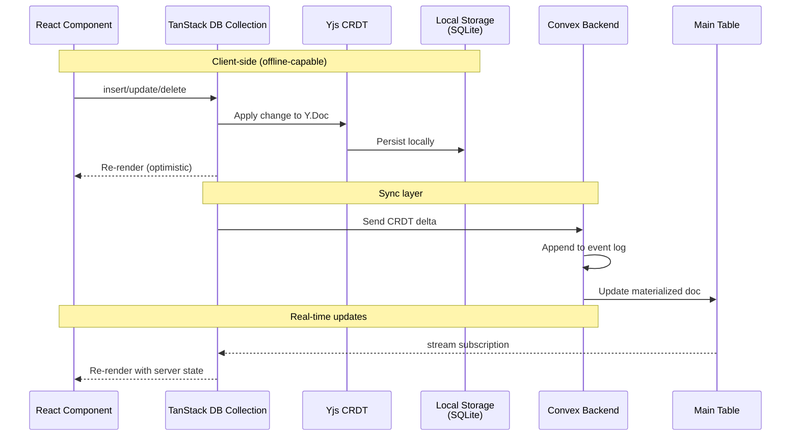
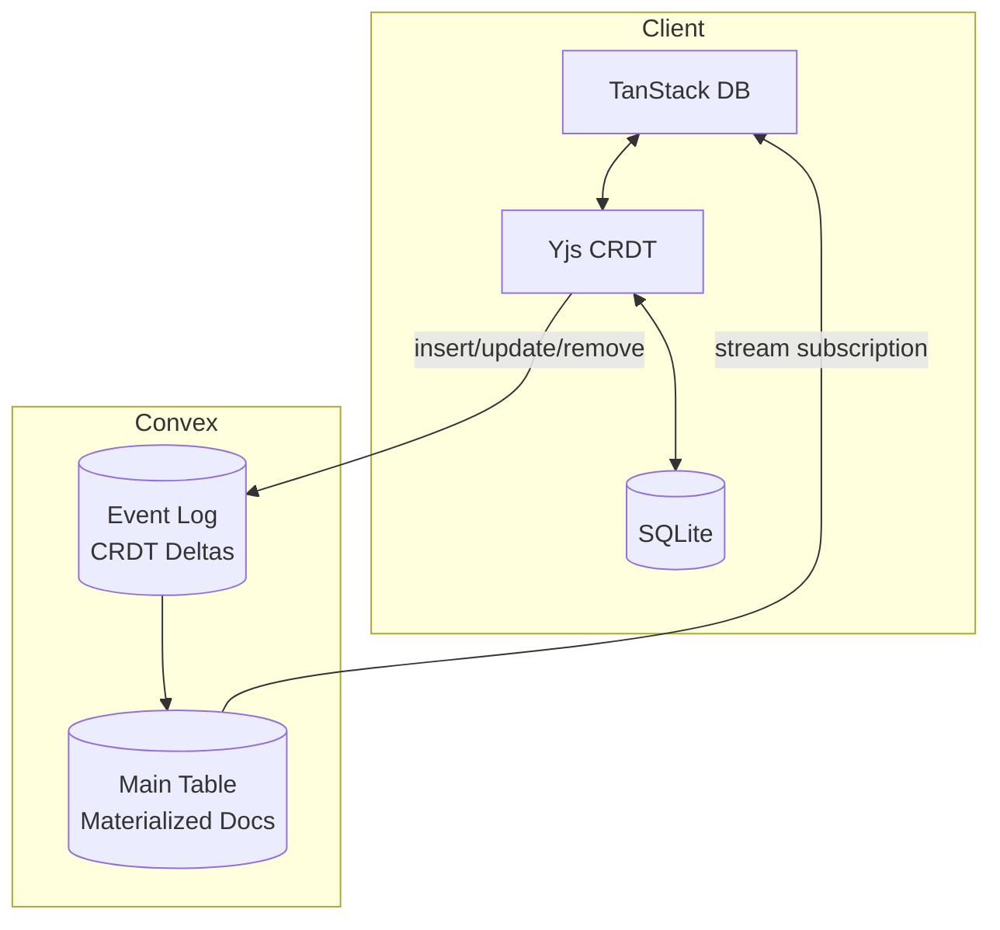

# Replicate

**Offline-first sync library using Yjs CRDTs and Convex for real-time data synchronization.**

Replicate provides a dual-storage architecture for building offline-capable applications with automatic conflict resolution. It combines Yjs CRDTs with TanStack DB's reactive state management and Convex's reactive backend for real-time synchronization and efficient querying.

## Architecture

### Data Flow



### Dual-Storage Pattern



**Why dual storage?**

- **Event Log (Component)**: Append-only CRDT deltas for conflict resolution and history
- **Main Table**: Materialized current state for efficient queries and indexes
- Similar to CQRS: event log = write model, main table = read model

## Installation

```bash
# Using bun (recommended)
bun add @trestleinc/replicate

# Using pnpm
pnpm add @trestleinc/replicate

# Using npm (v7+)
npm install @trestleinc/replicate
```

## Quick Start

### Step 1: Install the Convex Component

Add the replicate component to your Convex app configuration:

```typescript
// convex/convex.config.ts
import { defineApp } from 'convex/server';
import replicate from '@trestleinc/replicate/convex.config';

const app = defineApp();
app.use(replicate);

export default app;
```

### Step 2: Define Your Schema

Use the `schema.table()` helper to automatically inject required fields:

```typescript
// convex/schema.ts
import { defineSchema } from 'convex/server';
import { v } from 'convex/values';
import { schema } from '@trestleinc/replicate/server';

export default defineSchema({
  tasks: schema.table(
    {
      // Your application fields only!
      // timestamp is automatically injected by schema.table()
      id: v.string(),
      text: v.string(),
      isCompleted: v.boolean(),
    },
    (t) => t
      .index('by_doc_id', ['id'])      // Required for document lookups
      .index('by_timestamp', ['timestamp']) // Required for incremental sync
  ),
});
```

**What `schema.table()` does:**

- Automatically injects `timestamp: v.number()` (for incremental sync)
- You only define your business logic fields

**Required indexes:**

- `by_doc_id` on `['id']` - Enables fast document lookups during updates
- `by_timestamp` on `['timestamp']` - Enables efficient incremental synchronization

### Step 3: Create Replication Functions

Use `collection.create()` to create server-side collection functions:

```typescript
// convex/tasks.ts
import { collection } from '@trestleinc/replicate/server';
import { components } from './_generated/api';
import type { Task } from '../src/useTasks';

export const {
  stream,
  material,
  recovery,
  insert,
  update,
  remove,
  mark,
  compact,
  sessions,
  presence,
} = collection.create<Task>(components.replicate, 'tasks');
```

**What `collection.create()` generates:**

- `stream` - Real-time CRDT stream query (cursor-based subscriptions with `seq` numbers)
- `material` - SSR-friendly query (for server-side rendering)
- `recovery` - State vector sync query (for startup reconciliation)
- `insert` - Dual-storage insert mutation (auto-compacts when threshold exceeded)
- `update` - Dual-storage update mutation (auto-compacts when threshold exceeded)
- `remove` - Dual-storage delete mutation (auto-compacts when threshold exceeded)
- `mark` - Report sync progress to server (peer tracking for safe compaction)
- `compact` - Manual compaction trigger (peer-aware, respects active peer sync state)
- `sessions` - Get connected sessions with cursor positions (presence query)
- `presence` - Join/leave presence for collaborative editing (with cursor, user, profile)

### Step 4: Define Your Collection

Create a collection definition using `collection.create()`. This is SSR-safe because persistence and config are deferred until `init()` is called in the browser:

```typescript
// src/collections/tasks.ts
import { collection, persistence } from '@trestleinc/replicate/client';
import { ConvexClient } from 'convex/browser';
import { api } from '../../convex/_generated/api';
import schema from '../../convex/schema';

// Create lazy-initialized collection (SSR-safe)
// Types are inferred from Convex schema - no Zod needed!
export const tasks = collection.create(schema, 'tasks', {
  persistence: async () => {
    const { PGlite } = await import('@electric-sql/pglite');
    const db = new PGlite('idb://tasks');
    return persistence.pglite(db, 'tasks');
  },
  config: () => ({
    convexClient: new ConvexClient(import.meta.env.VITE_CONVEX_URL),
    api: api.tasks,
    getKey: (task) => task.id,
  }),
});

// Type is inferred from collection - no separate definition needed!
export type Task = NonNullable<typeof tasks.$docType>;
```

**Key points:**

- `collection.create(schema, tableName, options)` - pass Convex schema and table name
- Types are automatically inferred from the Convex schema - no Zod required
- `$docType` phantom property exposes the document type for extraction
- Prose fields are auto-detected from Convex validators

### Step 5: Initialize and Use in Components

Initialize the collection once in your app's entry point (browser only), then use it in components:

```typescript
// src/routes/__root.tsx (or app entry point)
import { tasks } from '../collections/tasks';

// Initialize once during app startup (browser only)
// For SSR frameworks, do this in a client-side effect or loader
await tasks.init();
```

```typescript
// src/components/TaskList.tsx
import { useLiveQuery } from '@tanstack/react-db';
import { tasks, type Task } from '../collections/tasks';

export function TaskList() {
  const collection = tasks.get();
  const { data: taskList, isLoading, isError } = useLiveQuery(collection);

  const handleCreate = () => {
    collection.insert({
      id: crypto.randomUUID(),
      text: 'New task',
      isCompleted: false,
    });
  };

  const handleUpdate = (id: string, isCompleted: boolean) => {
    collection.update(id, (draft: Task) => {
      draft.isCompleted = !isCompleted;
    });
  };

  const handleDelete = (id: string) => {
    // Hard delete - physically removes from main table
    collection.delete(id);
  };

  if (isError) {
    return <div>Error loading tasks. Please refresh.</div>;
  }

  if (isLoading) {
    return <div>Loading tasks...</div>;
  }

  return (
    <div>
      <button onClick={handleCreate}>Add Task</button>

      {taskList.map((task) => (
        <div key={task.id}>
          <input
            type="checkbox"
            checked={task.isCompleted}
            onChange={() => handleUpdate(task.id, task.isCompleted)}
          />
          <span>{task.text}</span>
          <button onClick={() => handleDelete(task.id)}>Delete</button>
        </div>
      ))}
    </div>
  );
}
```

**Lifecycle:**

1. `collection.create()` - Define collection (module-level, SSR-safe)
2. `await tasks.init()` - Initialize persistence and config (browser only, call once)
3. `tasks.get()` - Get the TanStack DB collection instance (after init)

### Step 6: Server-Side Rendering (Recommended)

For frameworks that support SSR (TanStack Start, Next.js, Remix, SvelteKit), preloading data on the server enables instant page loads.

**Why SSR is recommended:**

- **Instant page loads** - No loading spinners on first render
- **Better SEO** - Content visible to search engines
- **Reduced client work** - Data already available on hydration
- **Seamless transition** - Real-time sync takes over after hydration

**Step 1: Prefetch material on the server**

Use `ConvexHttpClient` to fetch data during SSR. The `material` query is generated by `collection.create()`:

```typescript
// TanStack Start: src/routes/__root.tsx
import { createRootRoute } from '@tanstack/react-router';
import { ConvexHttpClient } from 'convex/browser';
import { api } from '../convex/_generated/api';

const httpClient = new ConvexHttpClient(import.meta.env.VITE_CONVEX_URL);

export const Route = createRootRoute({
  loader: async () => {
    const tasksMaterial = await httpClient.query(api.tasks.material);
    return { tasksMaterial };
  },
});
```

```typescript
// SvelteKit: src/routes/+layout.server.ts
import { ConvexHttpClient } from 'convex/browser';
import { api } from '../convex/_generated/api';
import { PUBLIC_CONVEX_URL } from '$env/static/public';

const httpClient = new ConvexHttpClient(PUBLIC_CONVEX_URL);

export async function load() {
  const tasksMaterial = await httpClient.query(api.tasks.material);
  return { tasksMaterial };
}
```

**Step 2: Pass material to init() on the client**

```typescript
// TanStack Start: src/routes/__root.tsx (client component)
import { tasks } from '../collections/tasks';

function RootComponent() {
  const { tasksMaterial } = Route.useLoaderData();

  useEffect(() => {
    // Initialize with SSR data - no loading state!
    tasks.init(tasksMaterial);
  }, []);

  return <Outlet />;
}
```

```svelte
<!-- SvelteKit: src/routes/+layout.svelte -->
<script lang="ts">
  import { tasks } from '../collections/tasks';
  import { onMount } from 'svelte';

  export let data; // From +layout.server.ts

  onMount(async () => {
    await tasks.init(data.tasksMaterial);
  });
</script>
```

**Note:** If your framework doesn't support SSR, just call `await tasks.init()` without arguments - it will fetch data on mount and show a loading state.

## Sync Protocol

Replicate uses cursor-based sync with peer tracking for safe compaction.

### `stream` - Cursor-Based Real-Time Sync

The primary sync mechanism uses monotonically increasing sequence numbers (`seq`):

1. Client subscribes with last known `cursor` (seq number)
2. Server returns all changes with `seq > cursor`
3. Client applies changes and updates local cursor
4. Client calls `mark` to report sync progress to server
5. Subscription stays open for live updates

This approach enables:

- **Safe compaction**: Server knows which deltas each peer has synced
- **Peer tracking**: Active peers are tracked via `mark` calls
- **No data loss**: Compaction only removes deltas all active peers have received

### `mark` - Peer Sync Tracking

Clients report their sync progress to the server:

```typescript
// Called automatically after applying changes
await convexClient.mutation(api.tasks.mark, {
  peerId: "client-uuid",
  syncedSeq: 42,  // Last processed seq number
});
```

The server tracks:

- Which peers are actively syncing
- Each peer's last synced `seq` number
- Peer timeout for cleanup (configurable via `peerTimeout`)

### `compact` - Peer-Aware Compaction

Compaction is safe because it respects peer sync state:

1. Server checks minimum `syncedSeq` across all active peers
2. Only deletes deltas where `seq < minSyncedSeq`
3. Ensures no active peer loses data they haven't synced

**Compaction triggers:**

- **Automatic**: When document deltas exceed `sizeThreshold`
- **Manual**: Via `compact` mutation

### `recovery` - State Vector Sync

Used on startup to reconcile client and server state using Yjs state vectors:

1. Client encodes its local Y.Doc state vector (compact representation of what it has)
2. Server merges all snapshots + deltas into full state
3. Server computes diff between its state and client's state vector
4. Server returns only the missing bytes
5. Client applies the diff to catch up

**When recovery is used:**

- App startup (before stream subscription begins)
- After extended offline periods
- When cursor-based sync can't satisfy the request (deltas compacted)

## Delete Pattern: Hard Delete with Event History

Replicate uses **hard deletes** where items are physically removed from the main table, while the internal component preserves complete event history.

**Why hard delete?**

- Clean main table (no filtering required)
- Standard TanStack DB operations
- Complete audit trail preserved in component event log
- Proper CRDT conflict resolution maintained
- Foundation for future recovery features

**Implementation:**

```typescript
// Delete handler (uses collection.delete)
const handleDelete = (id: string) => {
  collection.delete(id);  // Hard delete - physically removes from main table
};

// UI usage - no filtering needed!
const { data: tasks } = useLiveQuery(collection);

// SSR loader - no filtering needed!
export const Route = createFileRoute('/')({
  loader: async () => {
    const tasks = await httpClient.query(api.tasks.material);
    return { tasks };
  },
});
```

**How it works:**

1. Client calls `collection.delete(id)`
2. `onRemove` handler captures Yjs deletion delta
3. Delta appended to component event log (history preserved)
4. Main table: document physically removed
5. Other clients notified and item removed locally

## Advanced Usage

### Custom Hooks and Lifecycle Events

You can customize the behavior of generated functions using optional hooks:

```typescript
// convex/tasks.ts
import { collection } from '@trestleinc/replicate/server';
import { components } from './_generated/api';
import type { Task } from '../src/useTasks';

export const {
  stream,
  material,
  recovery,
  insert,
  update,
  remove,
  mark,
  compact,
  sessions,
  presence,
} = collection.create<Task>(components.replicate, 'tasks', {
  // Optional hooks for authorization and lifecycle events
  hooks: {
    // Permission checks (eval* hooks validate BEFORE execution, throw to deny)
    evalRead: async (ctx, collection) => {
      const userId = await ctx.auth.getUserIdentity();
      if (!userId) throw new Error('Unauthorized');
    },
    evalWrite: async (ctx, doc) => {
      const userId = await ctx.auth.getUserIdentity();
      if (!userId) throw new Error('Unauthorized');
    },
    evalRemove: async (ctx, document) => {
      const userId = await ctx.auth.getUserIdentity();
      if (!userId) throw new Error('Unauthorized');
    },
    evalMark: async (ctx, peerId) => {
      // Validate peer identity
      const userId = await ctx.auth.getUserIdentity();
      if (!userId) throw new Error('Unauthorized');
    },
    evalCompact: async (ctx, document) => {
      // Restrict compaction to admin users
      const userId = await ctx.auth.getUserIdentity();
      if (!userId) throw new Error('Unauthorized');
    },

    // Lifecycle callbacks (on* hooks run AFTER execution)
    onStream: async (ctx, result) => { /* after stream query */ },
    onInsert: async (ctx, doc) => { /* after insert */ },
    onUpdate: async (ctx, doc) => { /* after update */ },
    onRemove: async (ctx, document) => { /* after remove */ },

    // Transform hook (modify documents before returning)
    transform: async (docs) => docs.filter(d => d.isPublic),
  }
});
```

### Rich Text / Prose Fields

For collaborative rich text editing, use `schema.prose()` in your Convex schema:

```typescript
// convex/schema.ts
import { schema } from '@trestleinc/replicate/server';

export default defineSchema({
  notebooks: schema.table({
    id: v.string(),
    title: v.string(),
    content: schema.prose(),  // ProseMirror-compatible JSON (auto-detected on client)
  }),
});

// Client: Extract plain text for search
import { schema } from '@trestleinc/replicate/client';

const plainText = schema.prose.extract(notebook.content);

// Client: Get editor binding for ProseMirror/TipTap
const binding = await collection.utils.prose(notebookId, 'content');
```

**Note:** Prose fields are automatically detected on the client by introspecting the Convex validator structure. No separate client-side schema definition needed.

**Important:** `collection.utils.prose()` is async and internally waits for the actor system to initialize before observing the Yjs fragment. This ensures the sync infrastructure is ready before collaborative editing begins.

```typescript
// React: Use useEffect with cleanup
useEffect(() => {
  let binding: EditorBinding | null = null;

  collection.utils.prose(docId, 'content').then((b) => {
    binding = b;
    // Initialize your editor with binding.fragment and binding.provider
  });

  return () => binding?.destroy();
}, [docId]);

// Svelte: Use onMount
onMount(async () => {
  binding = await collection.utils.prose(docId, 'content');
  // Initialize TipTap with binding.fragment

  return () => binding?.destroy();
});
```

**Prose Options:**

```typescript
interface ProseOptions {
  user?: UserIdentity;  // Collaborative presence identity
  debounceMs?: number;  // Sync debounce delay (default: 200ms)
}

interface UserIdentity {
  name?: string;   // Display name for cursor labels
  color?: string;  // Cursor/selection color (hex, e.g., "#6366f1")
  avatar?: string; // Avatar URL for presence indicators
}
```

**Configuration Examples:**

```typescript
// Minimal: Just get the binding with defaults
const binding = await collection.utils.prose(docId, 'content');

// With user presence for collaborative cursors
const binding = await collection.utils.prose(docId, 'content', {
  user: {
    name: 'Alice',
    color: '#6366f1',
    avatar: 'https://example.com/alice.jpg',
  },
});

// Custom debounce: 500ms for less frequent syncs
const binding = await collection.utils.prose(docId, 'content', {
  debounceMs: 500,
});

// Real-time: No debounce (sync on every keystroke)
const binding = await collection.utils.prose(docId, 'content', {
  debounceMs: 0,
});

// Full configuration
const binding = await collection.utils.prose(docId, 'content', {
  user: { name: 'Alice', color: '#6366f1' },
  debounceMs: 200,
});
```

### Persistence Providers

Choose the right storage backend for your platform. Persistence is configured in the `persistence` factory of `collection.create()`:

```typescript
import { collection, persistence } from '@trestleinc/replicate/client';

// Browser: PGlite (PostgreSQL in browser via IndexedDB)
export const tasks = collection.create({
  persistence: async () => {
    const { PGlite } = await import('@electric-sql/pglite');
    const db = new PGlite('idb://my-app-db');
    return persistence.pglite(db, 'tasks');
  },
  config: () => ({ /* ... */ }),
});

// Browser: PGlite singleton (shared across multiple collections)
// Use persistence.pglite.once() when you want one database for all collections
import { persistence } from '@trestleinc/replicate/client';
import { PGlite } from '@electric-sql/pglite';

// Create shared PGlite factory (module level)
const pglite = async () => {
  const db = new PGlite('idb://my-app-db');
  return persistence.pglite.once(db, 'my-app');
};

export const tasks = collection.create({
  persistence: pglite,  // Shared instance
  config: () => ({ /* ... */ }),
});

export const comments = collection.create({
  persistence: pglite,  // Same shared instance
  config: () => ({ /* ... */ }),
});

// React Native: Native SQLite (op-sqlite)
export const tasks = collection.create({
  persistence: async () => {
    const { open } = await import('@op-engineering/op-sqlite');
    const db = open({ name: 'my-app-db' });
    return persistence.sqlite.native(db, 'my-app-db');
  },
  config: () => ({ /* ... */ }),
});

// Testing: In-memory (no persistence)
export const tasks = collection.create({
  persistence: async () => persistence.memory(),
  config: () => ({ /* ... */ }),
});

// Custom backend: Implement StorageAdapter interface
export const tasks = collection.create({
  persistence: async () => persistence.custom(new MyCustomAdapter()),
  config: () => ({ /* ... */ }),
});
```

**PGlite** - PostgreSQL compiled to WASM, stored in IndexedDB. Full SQL support with reactive queries. Recommended for web apps.

**PGlite Singleton** - Use `persistence.pglite.once()` when multiple collections should share one database. Reference counted for proper cleanup.

**SQLite Native** - Uses op-sqlite for React Native. You create the database and pass it.

**Memory** - No persistence, useful for testing.

**Custom** - Implement `StorageAdapter` for any storage backend.

### Custom Storage Backends

Implement `StorageAdapter` for custom storage (Chrome extensions, localStorage, cloud storage):

```typescript
import { persistence, type StorageAdapter } from '@trestleinc/replicate/client';

class ChromeStorageAdapter implements StorageAdapter {
  async get(key: string): Promise<Uint8Array | undefined> {
    const result = await chrome.storage.local.get(key);
    return result[key] ? new Uint8Array(result[key]) : undefined;
  }

  async set(key: string, value: Uint8Array): Promise<void> {
    await chrome.storage.local.set({ [key]: Array.from(value) });
  }

  async delete(key: string): Promise<void> {
    await chrome.storage.local.remove(key);
  }

  async keys(prefix: string): Promise<string[]> {
    const all = await chrome.storage.local.get(null);
    return Object.keys(all).filter(k => k.startsWith(prefix));
  }
}

// Use custom adapter
const chromePersistence = persistence.custom(new ChromeStorageAdapter());
```

### Logging

Replicate uses a unified LogTape logger with ANSI colored console output. The logger is automatically configured when the library loads.

**Internal usage (for library contributors):**

```typescript
// Import from shared, not client or component
import { getLogger } from '$/shared/logger';

const logger = getLogger(['sync']);  // Category: replicate:sync
logger.debug('Processing changes');
logger.info('Sync complete');
logger.warn('Retrying operation');
logger.error('Failed to connect');
```

**Custom configuration (optional):**

If you need to customize logging in your app, you can reconfigure LogTape:

```typescript
// src/routes/__root.tsx or app entry point
import { configure, getConsoleSink } from '@logtape/logtape';

await configure({
  reset: true,  // Override library defaults
  sinks: { console: getConsoleSink() },
  loggers: [
    {
      category: ['replicate'],
      lowestLevel: 'info',  // 'debug' | 'info' | 'warn' | 'error'
      sinks: ['console']
    }
  ],
});
```

## API Reference

### Client-Side (`@trestleinc/replicate/client`)

#### `collection.create(schema, tableName, options)`

Creates a lazy-initialized collection with automatic type inference from Convex schema.

**Parameters:**

- `schema` - Your Convex schema (import from `convex/schema`)
- `tableName` - Table name (must exist in schema)
- `options.persistence` - Async factory returning a `Persistence` instance
- `options.config` - Sync factory returning collection config (ConvexClient, api, etc.)

**Returns:** `LazyCollection<T>` with `init(material?)`, `get()`, and `$docType` for type extraction

**Example:**

```typescript
import { collection, persistence } from '@trestleinc/replicate/client';
import { ConvexClient } from 'convex/browser';
import schema from '../../convex/schema';
import { api } from '../../convex/_generated/api';

export const tasks = collection.create(schema, 'tasks', {
  persistence: async () => {
    const { PGlite } = await import('@electric-sql/pglite');
    const db = new PGlite('idb://tasks');
    return persistence.pglite(db, 'tasks');
  },
  config: () => ({
    convexClient: new ConvexClient(import.meta.env.VITE_CONVEX_URL),
    api: api.tasks,
    getKey: (task) => task.id,
  }),
});

// Extract type from collection
export type Task = NonNullable<typeof tasks.$docType>;

// In your app initialization (browser only):
await tasks.init(material);
const collection = tasks.get();
```

**SSR Prefetch (server-side):**

```typescript
// SvelteKit: +layout.server.ts
import { ConvexHttpClient } from 'convex/browser';
const httpClient = new ConvexHttpClient(PUBLIC_CONVEX_URL);

export async function load() {
  const material = await httpClient.query(api.tasks.material);
  return { material };
}
```

#### Collection Config Options

The `config` factory in `collection.create()` accepts these options:

```typescript
interface CollectionConfig<T> {
  getKey: (item: T) => string | number;  // Extract unique key from item
  convexClient: ConvexClient;     // Convex client instance
  api: {                          // API from server collection.create()
    stream: FunctionReference;    // Real-time subscription
    insert: FunctionReference;    // Insert mutation
    update: FunctionReference;    // Update mutation
    remove: FunctionReference;    // Delete mutation
    recovery: FunctionReference;  // State vector sync
    mark: FunctionReference;      // Peer sync tracking
    compact: FunctionReference;   // Manual compaction
    material?: FunctionReference; // SSR hydration query
  };
}
```

**Example:**

```typescript
import schema from '../../convex/schema';

export const tasks = collection.create(schema, 'tasks', {
  persistence: async () => {
    const { PGlite } = await import('@electric-sql/pglite');
    const db = new PGlite('idb://tasks');
    return persistence.pglite(db, 'tasks');
  },
  config: () => ({
    convexClient: new ConvexClient(import.meta.env.VITE_CONVEX_URL),
    api: api.tasks,
    getKey: (task) => task.id,
  }),
});

// Type extracted from collection
export type Task = NonNullable<typeof tasks.$docType>;
```

#### `schema.prose.extract(proseJson)`

Extract plain text from ProseMirror JSON.

**Parameters:**

- `proseJson` - ProseMirror JSON structure (XmlFragmentJSON)

**Returns:** `string` - Plain text content

**Example:**

```typescript
import { schema } from '@trestleinc/replicate/client';

const plainText = schema.prose.extract(task.content);
```

#### Persistence Providers

```typescript
import { persistence, type StorageAdapter } from '@trestleinc/replicate/client';

// Persistence providers (use in collection.create persistence factory)
persistence.pglite(db, name)           // Browser: PGlite (PostgreSQL in IndexedDB)
persistence.pglite.once(db, name)      // Browser: PGlite singleton (shared across collections)
persistence.sqlite.native(db, name)    // React Native: op-sqlite
persistence.memory()                   // Testing: in-memory (no persistence)
persistence.custom(adapter)            // Custom: your StorageAdapter implementation
```

**`persistence.pglite(db, name)`** - Browser persistence using PGlite (PostgreSQL compiled to WASM, stored in IndexedDB).

**`persistence.pglite.once(db, name)`** - Singleton PGlite instance for sharing across multiple collections. Reference counted for cleanup.

**`persistence.sqlite.native(db, name)`** - React Native SQLite using op-sqlite. You create the database and pass it.

**`persistence.memory()`** - In-memory, no persistence. Useful for testing.

**`persistence.custom(adapter)`** - Custom storage backend. Pass your `StorageAdapter` implementation.

#### `StorageAdapter` Interface

Implement for custom storage backends:

```typescript
interface StorageAdapter {
  /** Get value by key, returns undefined if not found */
  get(key: string): Promise<Uint8Array | undefined>;

  /** Set value by key */
  set(key: string, value: Uint8Array): Promise<void>;

  /** Delete value by key */
  delete(key: string): Promise<void>;

  /** List all keys matching prefix */
  keys(prefix: string): Promise<string[]>;

  /** Optional: cleanup when persistence is destroyed */
  close?(): void;
}
```

#### Error Classes

```typescript
import { errors } from '@trestleinc/replicate/client';

errors.Network           // Network-related failures
errors.IDB               // Storage read errors
errors.IDBWrite          // Storage write errors
errors.Reconciliation    // Phantom document cleanup errors
errors.Prose             // Rich text field errors
errors.CollectionNotReady// Collection not initialized
errors.NonRetriable      // Errors that should not be retried (auth, validation)
```

### Server-Side (`@trestleinc/replicate/server`)

#### `collection.create<T>(component, name, options?)`

Creates server-side collection functions that mirror the client-side collection.

**Parameters:**

- `component` - Your Convex component reference (`components.replicate`)
- `name` - Collection name (e.g., `'tasks'`)
- `options` - Optional configuration for compaction and hooks

**Example:**

```typescript
import { collection } from '@trestleinc/replicate/server';
import { components } from './_generated/api';

export const {
  stream, material, insert, update, remove, recovery, mark, compact, sessions, presence,
} = collection.create<Task>(components.replicate, 'tasks');
```

#### `CollectionOptions<T>`

Optional configuration for `collection.create()`.

**Config:**

```typescript
interface CollectionOptions<T> {
  // Optional: Compaction settings
  compaction?: {
    sizeThreshold?: Size;      // Size threshold: "100kb", "5mb", "1gb" (default: "5mb")
    peerTimeout?: Duration;    // Peer timeout: "30m", "24h", "7d" (default: "24h")
  };

  // Optional: Hooks for permissions and lifecycle
  hooks?: {
    // Permission checks (throw to reject)
    evalRead?: (ctx, collection) => Promise<void>;
    evalWrite?: (ctx, doc) => Promise<void>;
    evalRemove?: (ctx, document) => Promise<void>;
    evalMark?: (ctx, peerId) => Promise<void>;
    evalCompact?: (ctx, document) => Promise<void>;

    // Lifecycle callbacks (run after operation)
    onStream?: (ctx, result) => Promise<void>;
    onInsert?: (ctx, doc) => Promise<void>;
    onUpdate?: (ctx, doc) => Promise<void>;
    onRemove?: (ctx, document) => Promise<void>;

    // Transform hook (modify documents before returning)
    transform?: (docs) => Promise<T[]>;
  };
}
```

**Type-safe values:**

- `Size`: `"100kb"`, `"5mb"`, `"1gb"`, etc.
- `Duration`: `"30m"`, `"24h"`, `"7d"`, etc.

**Returns:** Object with generated functions:

- `stream` - Real-time CRDT stream query (cursor-based with `seq` numbers)
- `material` - SSR-friendly query for hydration
- `recovery` - State vector sync query (for startup reconciliation)
- `insert` - Dual-storage insert mutation (auto-compacts when threshold exceeded)
- `update` - Dual-storage update mutation (auto-compacts when threshold exceeded)
- `remove` - Dual-storage delete mutation (auto-compacts when threshold exceeded)
- `mark` - Peer sync tracking mutation (reports `syncedSeq` to server)
- `compact` - Manual compaction mutation (peer-aware, safe for active clients)
- `sessions` - Get connected sessions with cursor positions (presence query)
- `presence` - Join/leave presence mutation (with cursor, user, profile)

#### `schema.table(userFields, applyIndexes?)`

Automatically inject `timestamp` field for incremental sync.

**Parameters:**

- `userFields` - User's business logic fields
- `applyIndexes` - Optional callback to add indexes

**Returns:** TableDefinition with replication fields injected

**Example:**

```typescript
import { schema } from '@trestleinc/replicate/server';

tasks: schema.table(
  {
    id: v.string(),
    text: v.string(),
  },
  (t) => t
    .index('by_doc_id', ['id'])
    .index('by_timestamp', ['timestamp'])
)
```

#### `schema.prose()`

Validator for ProseMirror-compatible JSON fields.

**Returns:** Convex validator for prose fields

**Example:**

```typescript
content: schema.prose()  // Validates ProseMirror JSON structure
```

### Shared Types (`@trestleinc/replicate`)

```typescript
import type { ProseValue } from '@trestleinc/replicate';

// ProseValue - type alias for ProseMirror JSON structure
// Automatically inferred from schema.prose() fields in Convex schema
```

## React Native

React Native doesn't include the Web Crypto API by default. Install these polyfills:

```bash
npm install react-native-get-random-values react-native-random-uuid
```

Import them at the **very top** of your app's entry point (before any other imports):

```javascript
// index.js or app/_layout.tsx - MUST be first!
import "react-native-get-random-values";
import "react-native-random-uuid";

// Then your other imports...
```

This provides:

- `crypto.getRandomValues()` - Required by Yjs for CRDT operations
- `crypto.randomUUID()` - Used for generating document and peer IDs

See [`examples/expo/`](./examples/expo/) for a complete React Native example using Expo.

## Examples

### Interval - Linear-style Issue Tracker

A full-featured offline-first issue tracker built with Replicate, demonstrating real-world usage patterns.

**Live Demo:** [interval.robelest.com](https://interval.robelest.com)

**Source Code:** Available in three framework variants:

- [`examples/tanstack-start/`](./examples/tanstack-start/) - TanStack Start (React, web)
- [`examples/sveltekit/`](./examples/sveltekit/) - SvelteKit (Svelte, web)
- [`examples/expo/`](./examples/expo/) - Expo (React Native, mobile)

**Web features demonstrated:**

- Offline-first with PGlite persistence (PostgreSQL in IndexedDB)
- Rich text editing with TipTap + Yjs collaboration
- PWA with custom service worker
- Real-time sync across devices
- Search with client-side text extraction (`schema.prose.extract()`)

**Mobile features demonstrated (Expo):**

- Native SQLite persistence (op-sqlite)
- Plain TextInput prose binding via `useProseField` hook
- Crypto polyfills for React Native

## Project Structure

```
packages/replicate/src/
├── shared/
│   ├── index.ts         # All validators, types, Duration utilities, logger export
│   └── logger.ts        # Unified LogTape logger with ANSI colored output
├── client/
│   └── index.ts         # Collection factory, persistence providers, error types
├── server/
│   ├── index.ts         # Schema helpers, collection factory, Replicate class
│   └── collection.ts    # Server-side collection implementation
└── component/
    └── ...              # Convex component internals
```

### Getter / Factory / Namespace Pattern

Replicate follows a consistent API design pattern across all entry points:

**1. Factory Pattern** - Create collections with configuration:
```typescript
// Server: Create collection functions
import { collection } from "@trestleinc/replicate/server";

export const { stream, material, insert, update, remove, mark, compact } =
  collection.create<Task>(components.replicate, "tasks", {
    hooks: { evalWrite: async (ctx, doc) => { /* auth */ } },
  });

// Client: Create lazy-initialized collection
import { collection, persistence } from "@trestleinc/replicate/client";

export const tasks = collection.create(schema, "tasks", {
  persistence: async () => persistence.pglite(db, "tasks"),
  config: () => ({ convexClient, api: api.tasks, getKey: (t) => t.id }),
});
```

**2. Namespace Pattern** - Organized utilities:
```typescript
// Server schema utilities
import { schema } from "@trestleinc/replicate/server";

schema.table(fields, indexes)  // Define replication-enabled table
schema.prose()                 // ProseMirror field validator

// Client persistence providers
import { persistence } from "@trestleinc/replicate/client";

persistence.pglite(db, name)        // Browser: PGlite
persistence.sqlite.native(db, name) // React Native: op-sqlite
persistence.memory()                // Testing: in-memory
```

**3. Getter Pattern** - Direct access to collection methods:
```typescript
// After init(), get the TanStack DB collection
const collection = tasks.get();

// Direct method access
collection.insert(doc);
collection.update(id, updater);
collection.delete(id);
```

**4. Single Entry Point** - All exports consolidated per layer:
```typescript
// Server - everything from one import
import { collection, schema, Replicate } from "@trestleinc/replicate/server";

// Client - everything from one import
import { collection, persistence, errors } from "@trestleinc/replicate/client";

// Shared - all validators and types from one import
import type { ProseValue, Duration } from "@trestleinc/replicate";
```

## Development

```bash
bun run build         # Build with tsdown (includes ESLint + TypeScript checking)
bun run dev           # Watch mode
bun run clean         # Remove build artifacts
```

## License

Apache-2.0 License - see [LICENSE](./LICENSE) file for details.

Copyright 2025 Trestle Inc
