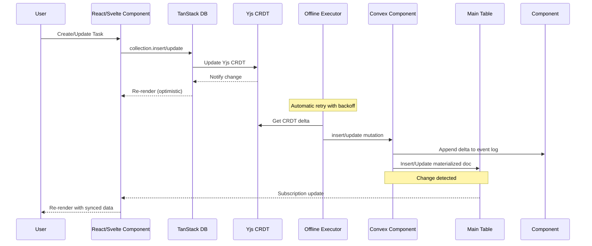
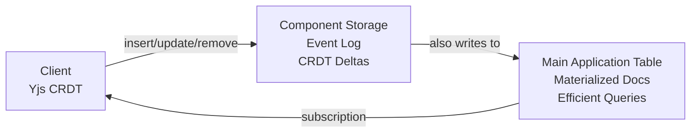

# Replicate

**Offline-first sync library using Yjs CRDTs and Convex for real-time data synchronization.**

Replicate provides a dual-storage architecture for building offline-capable applications with automatic conflict resolution. It combines Yjs CRDTs (96% smaller than Automerge, no WASM) with TanStack's offline transaction system and Convex's reactive backend for real-time synchronization and efficient querying.

## Features

- **Offline-first** - Works without internet, syncs when reconnected
- **Yjs CRDTs** - Automatic conflict-free replication with Yjs (96% smaller than Automerge, no WASM)
- **TanStack offline-transactions** - Proven outbox pattern for reliable offline sync
- **Real-time sync** - Convex WebSocket-based synchronization
- **TanStack DB integration** - Reactive state management for React and Svelte
- **Dual-storage pattern** - CRDT layer for conflict resolution + main tables for queries
- **Event sourcing** - Append-only event log preserves complete history
- **Type-safe** - Full TypeScript support
- **Multi-tab sync** - Changes sync instantly across browser tabs via TanStack coordination
- **SSR support** - Server-side rendering with data preloading
- **Network resilience** - Automatic retry with exponential backoff
- **Component-based** - Convex component for plug-and-play CRDT storage
- **React Native compatible** - No WASM dependency, works on mobile
- **Version history** - Create, list, restore, and prune document snapshots

## Architecture

### Data Flow: Real-Time Sync



### Dual-Storage Architecture



**Why both?**
- **Component Storage (Event Log)**: Append-only CRDT deltas, complete history, conflict resolution
- **Main Tables (Read Model)**: Current state, efficient server-side queries, indexes, and reactive subscriptions
- Similar to CQRS/Event Sourcing: component = event log, main table = materialized view

## Installation

```bash
# Using bun (recommended)
bun add @trestleinc/replicate

# Using pnpm
pnpm add @trestleinc/replicate

# Using npm (v7+)
npm install @trestleinc/replicate
```

## Quick Start

### Step 1: Install the Convex Component

Add the replicate component to your Convex app configuration:

```typescript
// convex/convex.config.ts
import { defineApp } from 'convex/server';
import replicate from '@trestleinc/replicate/convex.config';

const app = defineApp();
app.use(replicate);

export default app;
```

### Step 2: Define Your Schema

Use the `table()` helper to automatically inject required fields:

```typescript
// convex/schema.ts
import { defineSchema } from 'convex/server';
import { v } from 'convex/values';
import { table, prose } from '@trestleinc/replicate/server';

export default defineSchema({
  tasks: table(
    {
      // Your application fields only!
      // version and timestamp are automatically injected by table()
      id: v.string(),
      text: v.string(),
      isCompleted: v.boolean(),
    },
    (t) => t
      .index('by_user_id', ['id'])      // Required for document lookups
      .index('by_timestamp', ['timestamp']) // Required for incremental sync
  ),
});
```

**What `table()` does:**
- Automatically injects `version: v.number()` (for CRDT versioning)
- Automatically injects `timestamp: v.number()` (for incremental sync)
- You only define your business logic fields

**Required indexes:**
- `by_user_id` on `['id']` - Enables fast document lookups during updates
- `by_timestamp` on `['timestamp']` - Enables efficient incremental synchronization

### Step 3: Create Replication Functions

Create functions using the `define()` builder for a simple one-step API:

```typescript
// convex/tasks.ts
import { define } from '@trestleinc/replicate/server';
import { components } from './_generated/api';
import type { Task } from '../src/useTasks';

// One function call generates all operations
export const {
  stream,
  material,
  insert,
  update,
  remove,
  compact,
  prune,
  snapshot
} = define<Task>({
  component: components.replicate,
  collection: 'tasks',
  compaction: { retention: 90 },    // Optional: customize compaction (days)
  pruning: { retention: 180 }       // Optional: customize pruning (days)
});
```

**What `define()` generates:**

- `stream` - Real-time CRDT stream query (for client subscriptions)
- `material` - SSR-friendly query (for server-side rendering)
- `insert` - Dual-storage insert mutation
- `update` - Dual-storage update mutation
- `remove` - Dual-storage delete mutation
- `compact` - Compaction function (for cron jobs)
- `prune` - Snapshot cleanup function (for cron jobs)
- `snapshot` - Version history APIs (create, list, get, restore, remove, prune)

### Step 4: Create a Custom Hook

Create a hook that wraps TanStack DB with Convex collection options:

```typescript
// src/useTasks.ts
import { createCollection } from '@tanstack/react-db';
import { convexCollectionOptions } from '@trestleinc/replicate/client';
import { api } from '../convex/_generated/api';
import { convexClient } from './router';
import { useMemo } from 'react';

export interface Task {
  id: string;
  text: string;
  isCompleted: boolean;
}

// Module-level singleton to prevent multiple collection instances
// This ensures only one sync process runs, even across component remounts
let tasksCollection: ReturnType<typeof createCollection<Task>>;

export function useTasks(
  initialData?: { documents: Task[], checkpoint?: any, count?: number, crdtBytes?: Uint8Array }
) {
  return useMemo(() => {
    if (!tasksCollection) {
      tasksCollection = createCollection(
        convexCollectionOptions<Task>({
          convexClient,
          api: api.tasks,
          collection: 'tasks',
          getKey: (task) => task.id,
          material: initialData,
        })
      );
    }
    return tasksCollection;
  }, [initialData]);
}
```

### Step 5: Use in Components

```typescript
// src/routes/index.tsx
import { useLiveQuery } from '@tanstack/react-db';
import { useTasks } from '../useTasks';

export function TaskList() {
  const collection = useTasks();
  const { data: tasks, isLoading, isError } = useLiveQuery(collection);

  const handleCreate = () => {
    collection.insert({
      id: crypto.randomUUID(),
      text: 'New task',
      isCompleted: false,
    });
  };

  const handleUpdate = (id: string, isCompleted: boolean) => {
    collection.update(id, (draft: Task) => {
      draft.isCompleted = !isCompleted;
    });
  };

  const handleDelete = (id: string) => {
    // Hard delete - physically removes from main table
    collection.delete(id);
  };

  if (isError) {
    return <div>Error loading tasks. Please refresh.</div>;
  }

  if (isLoading) {
    return <div>Loading tasks...</div>;
  }

  return (
    <div>
      <button onClick={handleCreate}>Add Task</button>

      {tasks.map((task) => (
        <div key={task.id}>
          <input
            type="checkbox"
            checked={task.isCompleted}
            onChange={() => handleUpdate(task.id, task.isCompleted)}
          />
          <span>{task.text}</span>
          <button onClick={() => handleDelete(task.id)}>Delete</button>
        </div>
      ))}
    </div>
  );
}
```

### Step 6: Server-Side Rendering (Recommended)

For frameworks that support SSR (TanStack Start, Next.js, Remix, SvelteKit), preloading data on the server is the recommended approach for instant page loads and better SEO.

**Why SSR is recommended:**
- **Instant page loads** - No loading spinners on first render
- **Better SEO** - Content visible to search engines
- **Reduced client work** - Data already available on hydration
- **Seamless transition** - Real-time sync takes over after hydration

**Step 1: Use the `material` query from define()**

The `material` query is automatically generated by `define()` and returns all documents for SSR hydration.

**Step 2: Load data in your route loader**

```typescript
// src/routes/index.tsx
import { createFileRoute } from '@tanstack/react-router';
import { ConvexHttpClient } from 'convex/browser';
import { api } from '../convex/_generated/api';
import type { Task } from '../useTasks';

const httpClient = new ConvexHttpClient(import.meta.env.VITE_CONVEX_URL);

export const Route = createFileRoute('/')({
  loader: async () => {
    const tasks = await httpClient.query(api.tasks.material);
    return { tasks };
  },
});

function TasksPage() {
  const { tasks: initialTasks } = Route.useLoaderData();

  // Pass initialData to your hook - no loading state on first render!
  const collection = useTasks(initialTasks);
  const { data: tasks } = useLiveQuery(collection);

  return <TaskList tasks={tasks} />;
}
```

**Note:** If your framework doesn't support SSR, the collection works just fine without `initialData` - it will fetch data on mount and show a loading state.

## Delete Pattern: Hard Delete with Event History

Replicate uses **hard deletes** where items are physically removed from the main table, while the internal component preserves complete event history.

**Why hard delete?**
- Clean main table (no filtering required)
- Standard TanStack DB operations
- Complete audit trail preserved in component event log
- Proper CRDT conflict resolution maintained
- Foundation for future recovery features

**Implementation:**

```typescript
// Delete handler (uses collection.delete)
const handleDelete = (id: string) => {
  collection.delete(id);  // Hard delete - physically removes from main table
};

// UI usage - no filtering needed!
const { data: tasks } = useLiveQuery(collection);

// SSR loader - no filtering needed!
export const Route = createFileRoute('/')({
  loader: async () => {
    const tasks = await httpClient.query(api.tasks.material);
    return { tasks };
  },
});
```

**How it works:**
1. Client calls `collection.delete(id)`
2. `onRemove` handler captures Yjs deletion delta
3. Delta appended to component event log (history preserved)
4. Main table: document physically removed
5. Other clients notified and item removed locally

## Advanced Usage

### Custom Hooks and Lifecycle Events

You can customize the behavior of generated functions using optional hooks:

```typescript
// convex/tasks.ts
import { define } from '@trestleinc/replicate/server';
import { components } from './_generated/api';
import type { Task } from '../src/useTasks';

export const {
  stream,
  material,
  insert,
  update,
  remove
} = define<Task>({
  component: components.replicate,
  collection: 'tasks',

  // Optional: Permission checks (eval* hooks validate before execution)
  hooks: {
    evalRead: async (ctx, collection) => {
      const userId = await ctx.auth.getUserIdentity();
      if (!userId) throw new Error('Unauthorized');
    },
    evalWrite: async (ctx, doc) => {
      const userId = await ctx.auth.getUserIdentity();
      if (!userId) throw new Error('Unauthorized');
      if (doc.ownerId !== userId.subject) throw new Error('Unauthorized');
    },
    evalRemove: async (ctx, documentId) => {
      const userId = await ctx.auth.getUserIdentity();
      if (!userId) throw new Error('Unauthorized');
    },

    // Optional: Lifecycle callbacks (on* hooks run after execution)
    onInsert: async (ctx, doc) => {
      console.log('Inserted:', doc);
    },
    onUpdate: async (ctx, doc) => {
      console.log('Updated:', doc);
    },
    onRemove: async (ctx, documentId) => {
      console.log('Removed:', documentId);
    }
  }
});
```

### Rich Text / Prose Fields

For collaborative rich text editing, use the `prose()` validator and `extract()` function:

```typescript
// convex/schema.ts
import { table, prose } from '@trestleinc/replicate/server';

export default defineSchema({
  notebooks: table({
    id: v.string(),
    title: v.string(),
    content: prose(),  // ProseMirror-compatible JSON
  }),
});

// Client: Extract plain text for search
import { extract } from '@trestleinc/replicate/client';

const plainText = extract(notebook.content);

// Client: Get editor binding for ProseMirror/TipTap
const binding = await collection.utils.prose(notebookId, 'content');
```

### Version History (Snapshots)

Create and manage document version history:

```typescript
// convex/tasks.ts
export const { snapshot } = define<Task>({
  component: components.replicate,
  collection: 'tasks',
});

// Create a snapshot
await ctx.runMutation(api.tasks.snapshot.create, {
  documentId: 'task-123',
  label: 'Before major edit',
  createdBy: 'user-456',
});

// List versions
const versions = await ctx.runQuery(api.tasks.snapshot.list, {
  documentId: 'task-123',
  limit: 10,
});

// Restore a version
await ctx.runMutation(api.tasks.snapshot.restore, {
  documentId: 'task-123',
  versionId: 'version-789',
  createBackup: true,  // Optional: create backup before restore
});

// Prune old versions
await ctx.runMutation(api.tasks.snapshot.prune, {
  documentId: 'task-123',
  keepCount: 5,
  retentionDays: 30,
});
```

### Logging Configuration

Configure logging for debugging and development using LogTape:

```typescript
// src/routes/__root.tsx or app entry point
import { configure, getConsoleSink } from '@logtape/logtape';

await configure({
  sinks: { console: getConsoleSink() },
  loggers: [
    {
      category: ['convex-replicate'],
      lowestLevel: 'debug',  // 'debug' | 'info' | 'warn' | 'error'
      sinks: ['console']
    }
  ],
});
```

## API Reference

### Client-Side (`@trestleinc/replicate/client`)

#### `convexCollectionOptions<T>(config)`

Creates collection options for TanStack DB with Yjs CRDT integration.

**Config:**
```typescript
interface ConvexCollectionOptionsConfig<T> {
  convexClient: ConvexClient;
  api: {
    stream: FunctionReference;    // Real-time subscription endpoint
    insert: FunctionReference;    // Insert mutation
    update: FunctionReference;    // Update mutation
    remove: FunctionReference;    // Delete mutation
  };
  collection: string;
  getKey: (item: T) => string | number;
  material?: Materialized<T>;     // SSR hydration data
  prose?: Array<keyof T>;         // Optional: prose fields for rich text
  undoCaptureTimeout?: number;    // Undo stack merge window (default: 500ms)
}
```

**Returns:** Collection options for `createCollection()`

**Example:**
```typescript
const collection = createCollection(
  convexCollectionOptions<Task>({
    convexClient,
    api: api.tasks,
    collection: 'tasks',
    getKey: (task) => task.id,
    material: initialData,
  })
);
```

#### `extract(proseJson)`

Extract plain text from ProseMirror JSON.

**Parameters:**
- `proseJson` - ProseMirror JSON structure (XmlFragmentJSON)

**Returns:** `string` - Plain text content

**Example:**
```typescript
const plainText = extract(task.content);
```

### Server-Side (`@trestleinc/replicate/server`)

#### `define<T>(config)`

One-step builder function that generates all operations for a collection.

**Config:**
```typescript
interface DefineConfig<T> {
  component: any;              // components.replicate
  collection: string;          // Collection name (e.g., 'tasks')

  // Optional: Compaction settings
  compaction?: {
    retention: number;         // Days to retain deltas (default: 90)
  };

  // Optional: Pruning settings
  pruning?: {
    retention: number;         // Days to retain snapshots (default: 180)
  };

  // Optional: Version history settings
  versioning?: {
    keepCount?: number;        // Number of versions to keep (default: 10)
    retentionDays?: number;    // Days to retain versions (default: 90)
  };

  // Optional: Hooks for permissions and lifecycle
  hooks?: {
    // Permission checks (throw to reject)
    evalRead?: (ctx, collection) => Promise<void>;
    evalWrite?: (ctx, doc) => Promise<void>;
    evalRemove?: (ctx, documentId) => Promise<void>;

    // Lifecycle callbacks (run after operation)
    onInsert?: (ctx, doc) => Promise<void>;
    onUpdate?: (ctx, doc) => Promise<void>;
    onRemove?: (ctx, documentId) => Promise<void>;
  };
}
```

**Returns:** Object with generated functions:
- `stream` - Real-time CRDT stream query
- `material` - SSR-friendly query for hydration
- `insert` - Dual-storage insert mutation
- `update` - Dual-storage update mutation
- `remove` - Dual-storage delete mutation
- `compact` - Compaction function for cron jobs
- `prune` - Snapshot cleanup function for cron jobs
- `snapshot` - Version history APIs

#### `table(userFields, applyIndexes?)`

Automatically inject replication metadata fields (`version`, `timestamp`).

**Parameters:**
- `userFields` - User's business logic fields
- `applyIndexes` - Optional callback to add indexes

**Returns:** TableDefinition with replication fields injected

**Example:**
```typescript
tasks: table(
  {
    id: v.string(),
    text: v.string(),
  },
  (t) => t
    .index('by_user_id', ['id'])
    .index('by_timestamp', ['timestamp'])
)
```

#### `prose()`

Validator for ProseMirror-compatible JSON fields.

**Returns:** Convex validator for prose fields

**Example:**
```typescript
content: prose()  // Validates ProseMirror JSON structure
```

## Performance

### Storage Performance

- **IndexedDB** via TanStack DB provides efficient local storage
- **Yjs** CRDT operations are extremely fast (96% smaller than Automerge)
- **TanStack offline-transactions** provides batching and retry logic
- **Indexed queries** in Convex for fast incremental sync

### Sync Performance

- **Real-time updates** - WebSocket-based change notifications
- **Delta encoding** - Only send what changed (< 1KB per change vs 100KB+ full state)
- **Event sourcing** - Append-only writes, no update conflicts
- **Optimistic UI** - Instant updates without waiting for server

### Multi-Tab Sync

- **TanStack coordination** - Built-in multi-tab sync via BroadcastChannel
- **Yjs shared state** - Single source of truth per browser
- **Offline executor** - Only one tab runs sync operations

## Offline Behavior

### How It Works

- **Writes** - Queue locally in Yjs CRDT, sync when online via TanStack outbox
- **Reads** - Always work from local TanStack DB cache (instant!)
- **UI** - Fully functional with optimistic updates
- **Conflicts** - Auto-resolved by Yjs CRDTs (conflict-free!)

### Network Resilience

- Automatic retry with exponential backoff
- Network error detection (fetch errors, connection issues)
- Queue changes while offline
- Graceful degradation

## Examples

Complete working example: `examples/tanstack-start/`

**Files to explore:**
- `src/useTasks.ts` - Hook with TanStack DB integration
- `src/routes/index.tsx` - Component usage with SSR
- `src/routes/__root.tsx` - Logging configuration
- `convex/tasks.ts` - Replication functions using dual-storage helpers
- `convex/schema.ts` - Schema with `table()` helper

**Run the example:**
```bash
cd examples/tanstack-start
bun install
bun run dev
```

## Development

### Building

```bash
bun run build         # Build package using Rslib
bun run clean         # Remove build artifacts
bun run typecheck     # Type check
```

### Code Quality

```bash
bun run check         # Lint + format check (dry run)
bun run check:fix     # Auto-fix all issues (run before committing)
```

### Running Example

```bash
bun run dev:example   # Start example app + Convex dev environment
```

## License

Apache-2.0 License - see [LICENSE](./LICENSE) file for details.

Copyright 2025 Trestle Inc
