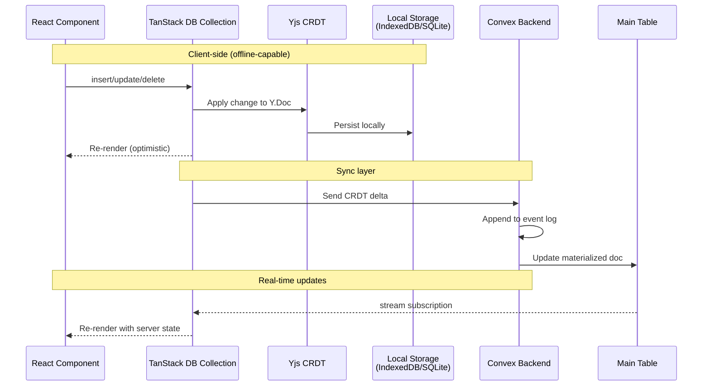
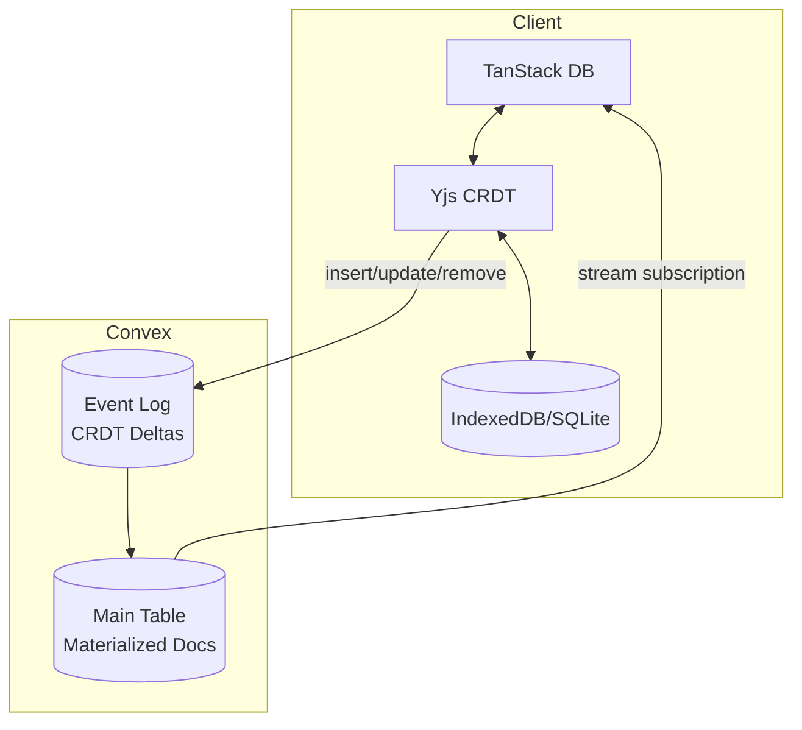

# Replicate

**Offline-first sync library using Yjs CRDTs and Convex for real-time data synchronization.**

Replicate provides a dual-storage architecture for building offline-capable applications with automatic conflict resolution. It combines Yjs CRDTs with TanStack DB's reactive state management and Convex's reactive backend for real-time synchronization and efficient querying.


## Architecture

### Data Flow



### Dual-Storage Pattern



**Why dual storage?**
- **Event Log (Component)**: Append-only CRDT deltas for conflict resolution and history
- **Main Table**: Materialized current state for efficient queries and indexes
- Similar to CQRS: event log = write model, main table = read model

## Installation

```bash
# Using bun (recommended)
bun add @trestleinc/replicate

# Using pnpm
pnpm add @trestleinc/replicate

# Using npm (v7+)
npm install @trestleinc/replicate
```

## Quick Start

### Step 1: Install the Convex Component

Add the replicate component to your Convex app configuration:

```typescript
// convex/convex.config.ts
import { defineApp } from 'convex/server';
import replicate from '@trestleinc/replicate/convex.config';

const app = defineApp();
app.use(replicate);

export default app;
```

### Step 2: Define Your Schema

Use the `schema.table()` helper to automatically inject required fields:

```typescript
// convex/schema.ts
import { defineSchema } from 'convex/server';
import { v } from 'convex/values';
import { schema } from '@trestleinc/replicate/server';

export default defineSchema({
  tasks: schema.table(
    {
      // Your application fields only!
      // timestamp is automatically injected by schema.table()
      id: v.string(),
      text: v.string(),
      isCompleted: v.boolean(),
    },
    (t) => t
      .index('by_doc_id', ['id'])      // Required for document lookups
      .index('by_timestamp', ['timestamp']) // Required for incremental sync
  ),
});
```

**What `schema.table()` does:**
- Automatically injects `timestamp: v.number()` (for incremental sync)
- You only define your business logic fields

**Required indexes:**
- `by_doc_id` on `['id']` - Enables fast document lookups during updates
- `by_timestamp` on `['timestamp']` - Enables efficient incremental synchronization

### Step 3: Create Replication Functions

Use `replicate()` to bind your component and create collection functions:

```typescript
// convex/tasks.ts
import { replicate } from '@trestleinc/replicate/server';
import { components } from './_generated/api';
import type { Task } from '../src/useTasks';

const r = replicate(components.replicate);

export const {
  stream,
  material,
  recovery,
  insert,
  update,
  remove,
} = r<Task>({
  collection: 'tasks',
  compaction: { threshold: 5_000_000 },  // Optional: size threshold for auto-compaction (default: 5MB)
});
```

**What `replicate()` generates:**

- `stream` - Real-time CRDT stream query (checkpoint-based subscriptions)
- `material` - SSR-friendly query (for server-side rendering)
- `recovery` - State vector sync query (for startup reconciliation)
- `insert` - Dual-storage insert mutation (auto-compacts when threshold exceeded)
- `update` - Dual-storage update mutation (auto-compacts when threshold exceeded)
- `remove` - Dual-storage delete mutation (auto-compacts when threshold exceeded)

### Step 4: Create a Custom Hook

Create a hook that wraps TanStack DB with Convex collection options:

```typescript
// src/useTasks.ts
import { createCollection, type Collection } from '@tanstack/react-db';
import { convexCollectionOptions } from '@trestleinc/replicate/client';
import { api } from '../convex/_generated/api';
import { convexClient } from './router';
import { useMemo } from 'react';

export interface Task {
  id: string;
  text: string;
  isCompleted: boolean;
}

// Define collection type with TanStack DB discriminator
// The singleResult property satisfies TanStack DB's NonSingleResult union type
type TasksCollection = Collection<Task> & {
  singleResult?: never;
};

// Module-level singleton to prevent multiple collection instances
// This ensures only one sync process runs, even across component remounts
let tasksCollection: TasksCollection | null = null;

export function useTasks(
  initialData?: { documents: Task[], checkpoint?: any, count?: number, crdtBytes?: Uint8Array }
) {
  return useMemo(() => {
    if (!tasksCollection) {
      // Note: The `as unknown as` cast is required because TanStack DB's
      // type inference expects StandardSchemaV1 compliance. This cast is
      // safe as convexCollectionOptions returns the correct runtime type.
      tasksCollection = createCollection(
        convexCollectionOptions<Task>({
          convexClient,
          api: api.tasks,
          collection: 'tasks',
          getKey: (task) => task.id,
          material: initialData,
        })
      ) as unknown as TasksCollection;
    }
    return tasksCollection;
  }, [initialData]);
}
```

### Step 5: Use in Components

```typescript
// src/routes/index.tsx
import { useLiveQuery } from '@tanstack/react-db';
import { useTasks } from '../useTasks';

export function TaskList() {
  const collection = useTasks();
  const { data: tasks, isLoading, isError } = useLiveQuery(collection);

  const handleCreate = () => {
    collection.insert({
      id: crypto.randomUUID(),
      text: 'New task',
      isCompleted: false,
    });
  };

  const handleUpdate = (id: string, isCompleted: boolean) => {
    collection.update(id, (draft: Task) => {
      draft.isCompleted = !isCompleted;
    });
  };

  const handleDelete = (id: string) => {
    // Hard delete - physically removes from main table
    collection.delete(id);
  };

  if (isError) {
    return <div>Error loading tasks. Please refresh.</div>;
  }

  if (isLoading) {
    return <div>Loading tasks...</div>;
  }

  return (
    <div>
      <button onClick={handleCreate}>Add Task</button>

      {tasks.map((task) => (
        <div key={task.id}>
          <input
            type="checkbox"
            checked={task.isCompleted}
            onChange={() => handleUpdate(task.id, task.isCompleted)}
          />
          <span>{task.text}</span>
          <button onClick={() => handleDelete(task.id)}>Delete</button>
        </div>
      ))}
    </div>
  );
}
```

### Step 6: Server-Side Rendering (Recommended)

For frameworks that support SSR (TanStack Start, Next.js, Remix, SvelteKit), preloading data on the server is the recommended approach for instant page loads and better SEO.

**Why SSR is recommended:**
- **Instant page loads** - No loading spinners on first render
- **Better SEO** - Content visible to search engines
- **Reduced client work** - Data already available on hydration
- **Seamless transition** - Real-time sync takes over after hydration

**Step 1: Use the `material` query from replicate()**

The `material` query is automatically generated by `replicate()` and returns all documents for SSR hydration.

**Step 2: Load data in your route loader**

```typescript
// src/routes/index.tsx
import { createFileRoute } from '@tanstack/react-router';
import { ConvexHttpClient } from 'convex/browser';
import { api } from '../convex/_generated/api';
import type { Task } from '../useTasks';

const httpClient = new ConvexHttpClient(import.meta.env.VITE_CONVEX_URL);

export const Route = createFileRoute('/')({
  loader: async () => {
    const tasks = await httpClient.query(api.tasks.material);
    return { tasks };
  },
});

function TasksPage() {
  const { tasks: initialTasks } = Route.useLoaderData();

  // Pass initialData to your hook - no loading state on first render!
  const collection = useTasks(initialTasks);
  const { data: tasks } = useLiveQuery(collection);

  return <TaskList tasks={tasks} />;
}
```

**Note:** If your framework doesn't support SSR, the collection works just fine without `initialData` - it will fetch data on mount and show a loading state.

## Sync Protocol

Replicate uses two complementary sync mechanisms:

### `stream` - Real-time Checkpoint Sync

The primary sync mechanism for real-time updates. Uses checkpoint-based incremental sync:

1. Client subscribes with last known checkpoint (timestamp)
2. Server returns all deltas since that checkpoint
3. Client applies deltas and updates checkpoint
4. Subscription stays open for live updates

This is efficient for ongoing sync but requires the server to have deltas going back to the client's checkpoint.

### `recovery` - State Vector Sync

Used on startup to reconcile client and server state using Yjs state vectors:

1. Client encodes its local Y.Doc state vector (compact representation of what it has)
2. Server merges all snapshots + deltas into full state
3. Server computes diff between its state and client's state vector
4. Server returns only the missing bytes
5. Client applies the diff to catch up

**When recovery is used:**
- App startup (before stream subscription begins)
- After extended offline periods
- When checkpoint-based sync can't satisfy the request (deltas compacted)

**Why both?**
- `stream` is optimized for real-time (small checkpoint, fast subscription)
- `recovery` handles cold starts and large gaps efficiently (state vectors)
- Together they ensure clients always sync correctly regardless of history

## Delete Pattern: Hard Delete with Event History

Replicate uses **hard deletes** where items are physically removed from the main table, while the internal component preserves complete event history.

**Why hard delete?**
- Clean main table (no filtering required)
- Standard TanStack DB operations
- Complete audit trail preserved in component event log
- Proper CRDT conflict resolution maintained
- Foundation for future recovery features

**Implementation:**

```typescript
// Delete handler (uses collection.delete)
const handleDelete = (id: string) => {
  collection.delete(id);  // Hard delete - physically removes from main table
};

// UI usage - no filtering needed!
const { data: tasks } = useLiveQuery(collection);

// SSR loader - no filtering needed!
export const Route = createFileRoute('/')({
  loader: async () => {
    const tasks = await httpClient.query(api.tasks.material);
    return { tasks };
  },
});
```

**How it works:**
1. Client calls `collection.delete(id)`
2. `onRemove` handler captures Yjs deletion delta
3. Delta appended to component event log (history preserved)
4. Main table: document physically removed
5. Other clients notified and item removed locally

## Advanced Usage

### Custom Hooks and Lifecycle Events

You can customize the behavior of generated functions using optional hooks:

```typescript
// convex/tasks.ts
import { replicate } from '@trestleinc/replicate/server';
import { components } from './_generated/api';
import type { Task } from '../src/useTasks';

const r = replicate(components.replicate);

export const {
  stream,
  material,
  recovery,
  insert,
  update,
  remove,
} = r<Task>({
  collection: 'tasks',

  // Optional hooks for authorization and lifecycle events
  hooks: {
    // Permission checks (eval* hooks validate BEFORE execution, throw to deny)
    evalRead: async (ctx, collection) => {
      const userId = await ctx.auth.getUserIdentity();
      if (!userId) throw new Error('Unauthorized');
    },
    evalWrite: async (ctx, doc) => {
      const userId = await ctx.auth.getUserIdentity();
      if (!userId) throw new Error('Unauthorized');
    },
    evalRemove: async (ctx, documentId) => {
      const userId = await ctx.auth.getUserIdentity();
      if (!userId) throw new Error('Unauthorized');
    },

    // Lifecycle callbacks (on* hooks run AFTER execution)
    onStream: async (ctx, result) => { /* after stream query */ },
    onInsert: async (ctx, doc) => { /* after insert */ },
    onUpdate: async (ctx, doc) => { /* after update */ },
    onRemove: async (ctx, documentId) => { /* after remove */ },

    // Transform hook (modify documents before returning)
    transform: async (docs) => docs.filter(d => d.isPublic),
  }
});
```

### Rich Text / Prose Fields

For collaborative rich text editing, use the `schema.prose()` validator and `prose.extract()` function:

```typescript
// convex/schema.ts
import { schema } from '@trestleinc/replicate/server';

export default defineSchema({
  notebooks: schema.table({
    id: v.string(),
    title: v.string(),
    content: schema.prose(),  // ProseMirror-compatible JSON
  }),
});

// Client: Extract plain text for search
import { prose } from '@trestleinc/replicate/client';

const plainText = prose.extract(notebook.content);

// Client: Get editor binding for ProseMirror/TipTap
const binding = await collection.utils.prose(notebookId, 'content');
```

### Persistence Providers

Choose the right storage backend for your platform:

```typescript
import { persistence, adapters } from '@trestleinc/replicate/client';

// Browser: IndexedDB (default, no config needed)
convexCollectionOptions<Task>({
  // ... other options
  persistence: persistence.indexeddb(),
});

// Browser SQLite: Uses sql.js WASM with OPFS persistence
// You initialize sql.js and pass the SQL object
import initSqlJs from 'sql.js';
const SQL = await initSqlJs({ locateFile: (file) => `/${file}` });
convexCollectionOptions<Task>({
  // ... other options
  persistence: await persistence.sqlite.browser(SQL, 'my-app-db'),
});

// React Native SQLite: Uses op-sqlite (native SQLite)
import { open } from '@op-engineering/op-sqlite';
const db = open({ name: 'my-app-db' });
convexCollectionOptions<Task>({
  // ... other options
  persistence: await persistence.sqlite.native(db, 'my-app-db'),
});

// Testing: In-memory (no persistence)
convexCollectionOptions<Task>({
  // ... other options
  persistence: persistence.memory(),
});
```

**IndexedDB** (default) - Uses y-indexeddb for Y.Doc persistence and browser-level for metadata. Browser only.

**SQLite Browser** - Uses sql.js (SQLite compiled to WASM) with OPFS persistence. You initialize sql.js yourself and pass the SQL object.

**SQLite Native** - Uses op-sqlite for React Native. You create the database and pass it.

**Memory** - No persistence, useful for testing without IndexedDB side effects.

### Logging Configuration

Configure logging for debugging and development using LogTape:

```typescript
// src/routes/__root.tsx or app entry point
import { configure, getConsoleSink } from '@logtape/logtape';

await configure({
  sinks: { console: getConsoleSink() },
  loggers: [
    {
      category: ['convex-replicate'],
      lowestLevel: 'debug',  // 'debug' | 'info' | 'warn' | 'error'
      sinks: ['console']
    }
  ],
});
```

## API Reference

### Client-Side (`@trestleinc/replicate/client`)

#### `convexCollectionOptions<T>(config)`

Creates collection options for TanStack DB with Yjs CRDT integration.

**Config:**
```typescript
interface ConvexCollectionOptionsConfig<T> {
  convexClient: ConvexClient;
  api: {
    stream: FunctionReference;    // Real-time subscription endpoint
    insert: FunctionReference;    // Insert mutation
    update: FunctionReference;    // Update mutation
    remove: FunctionReference;    // Delete mutation
  };
  collection: string;
  getKey: (item: T) => string | number;
  persistence?: Persistence;      // Optional: defaults to indexeddbPersistence()
  material?: Materialized<T>;     // SSR hydration data
  prose?: Array<keyof T>;         // Optional: prose fields for rich text
  undoCaptureTimeout?: number;    // Undo stack merge window (default: 500ms)
}
```

**Returns:** Collection options for `createCollection()`

**Example:**
```typescript
const collection = createCollection(
  convexCollectionOptions<Task>({
    convexClient,
    api: api.tasks,
    collection: 'tasks',
    getKey: (task) => task.id,
    material: initialData,
  })
);
```

#### `prose.extract(proseJson)`

Extract plain text from ProseMirror JSON.

**Parameters:**
- `proseJson` - ProseMirror JSON structure (XmlFragmentJSON)

**Returns:** `string` - Plain text content

**Example:**
```typescript
import { prose } from '@trestleinc/replicate/client';

const plainText = prose.extract(task.content);
```

#### Persistence Providers

```typescript
import { persistence, adapters } from '@trestleinc/replicate/client';

// Persistence providers
persistence.indexeddb()           // Browser: IndexedDB (default)
persistence.sqlite.browser(SQL, name)  // Browser: sql.js WASM + OPFS
persistence.sqlite.native(db, name)    // React Native: op-sqlite
persistence.memory()              // Testing: in-memory (no persistence)

// SQLite adapters (for advanced use)
adapters.sqljs    // SqlJsAdapter class for browser
adapters.opsqlite // OPSqliteAdapter class for React Native
```

**`persistence.indexeddb()`** - Browser-only, uses y-indexeddb + browser-level.

**`persistence.sqlite.browser(SQL, name)`** - Browser SQLite using sql.js WASM. You initialize sql.js and pass the SQL object.

**`persistence.sqlite.native(db, name)`** - React Native SQLite using op-sqlite. You create the database and pass it.

**`persistence.memory()`** - In-memory, no persistence. Useful for testing.

#### Error Classes

```typescript
import { errors } from '@trestleinc/replicate/client';

errors.Network           // Network-related failures
errors.IDB               // IndexedDB read errors
errors.IDBWrite          // IndexedDB write errors
errors.Reconciliation    // Phantom document cleanup errors
errors.Prose             // Rich text field errors
errors.CollectionNotReady// Collection not initialized
errors.NonRetriable      // Errors that should not be retried (auth, validation)
```

### Server-Side (`@trestleinc/replicate/server`)

#### `replicate(component)`

Factory function that creates a bound replicate function for your collections.

**Parameters:**
- `component` - Your Convex component reference (`components.replicate`)

**Returns:** A function `<T>(config: ReplicateConfig<T>)` that generates collection operations.

**Example:**
```typescript
import { replicate } from '@trestleinc/replicate/server';
import { components } from './_generated/api';

const r = replicate(components.replicate);
export const tasks = r<Task>({ collection: 'tasks' });
```

#### `ReplicateConfig<T>`

Configuration for the bound replicate function.

**Config:**
```typescript
interface ReplicateConfig<T> {
  collection: string;          // Collection name (e.g., 'tasks')

  // Optional: Auto-compaction settings
  compaction?: {
    threshold?: number;        // Size threshold in bytes (default: 5MB / 5_000_000)
  };

  // Optional: Hooks for permissions and lifecycle
  hooks?: {
    // Permission checks (throw to reject)
    evalRead?: (ctx, collection) => Promise<void>;
    evalWrite?: (ctx, doc) => Promise<void>;
    evalRemove?: (ctx, documentId) => Promise<void>;

    // Lifecycle callbacks (run after operation)
    onStream?: (ctx, result) => Promise<void>;
    onInsert?: (ctx, doc) => Promise<void>;
    onUpdate?: (ctx, doc) => Promise<void>;
    onRemove?: (ctx, documentId) => Promise<void>;

    // Transform hook (modify documents before returning)
    transform?: (docs) => Promise<T[]>;
  };
}
```

**Returns:** Object with generated functions:
- `stream` - Real-time CRDT stream query (checkpoint-based)
- `material` - SSR-friendly query for hydration
- `recovery` - State vector sync query (for startup reconciliation)
- `insert` - Dual-storage insert mutation (auto-compacts when threshold exceeded)
- `update` - Dual-storage update mutation (auto-compacts when threshold exceeded)
- `remove` - Dual-storage delete mutation (auto-compacts when threshold exceeded)

#### `schema.table(userFields, applyIndexes?)`

Automatically inject `timestamp` field for incremental sync.

**Parameters:**
- `userFields` - User's business logic fields
- `applyIndexes` - Optional callback to add indexes

**Returns:** TableDefinition with replication fields injected

**Example:**
```typescript
import { schema } from '@trestleinc/replicate/server';

tasks: schema.table(
  {
    id: v.string(),
    text: v.string(),
  },
  (t) => t
    .index('by_doc_id', ['id'])
    .index('by_timestamp', ['timestamp'])
)
```

#### `schema.prose()`

Validator for ProseMirror-compatible JSON fields.

**Returns:** Convex validator for prose fields

**Example:**
```typescript
content: schema.prose()  // Validates ProseMirror JSON structure
```

## Examples

### Interval - Linear-style Issue Tracker

A full-featured offline-first issue tracker built with Replicate, demonstrating real-world usage patterns.

🔗 **Live Demo:** [interval.robelest.com](https://interval.robelest.com)

📦 **Source Code:** Available in two framework variants:
- [`illustrations/web/tanstack-start/`](./illustrations/web/tanstack-start/) - TanStack Start (React)
- [`illustrations/web/sveltekit/`](./illustrations/web/sveltekit/) - SvelteKit (Svelte)

**Features demonstrated:**
- Offline-first with SQLite persistence (sql.js + OPFS)
- Rich text editing with TipTap + Yjs collaboration
- PWA with custom service worker
- Real-time sync across devices
- Search with client-side text extraction (`prose.extract()`)

## Development

```bash
bun run build         # Build with Rslib (includes ESLint + TypeScript checking)
bun run dev           # Watch mode
bun run clean         # Remove build artifacts
```

## License

Apache-2.0 License - see [LICENSE](./LICENSE) file for details.

Copyright 2025 Trestle Inc
